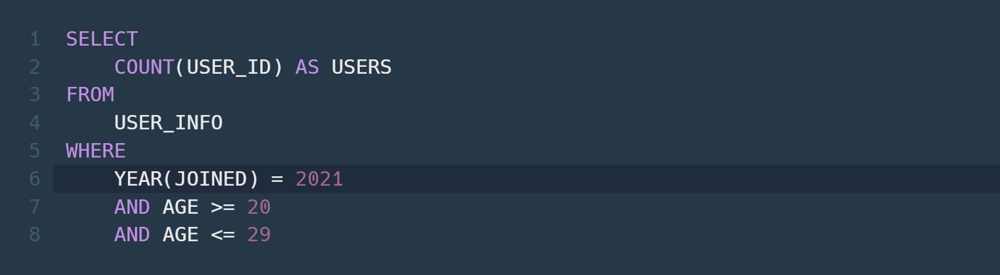
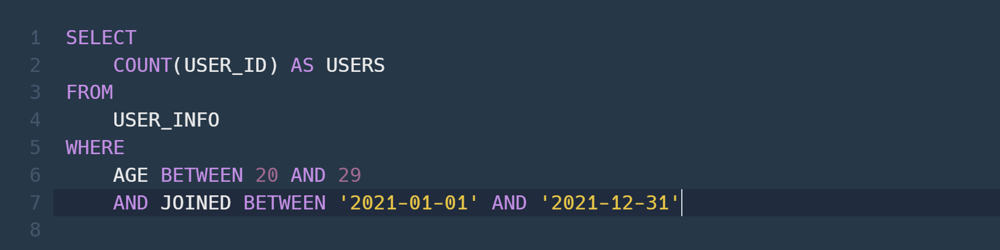
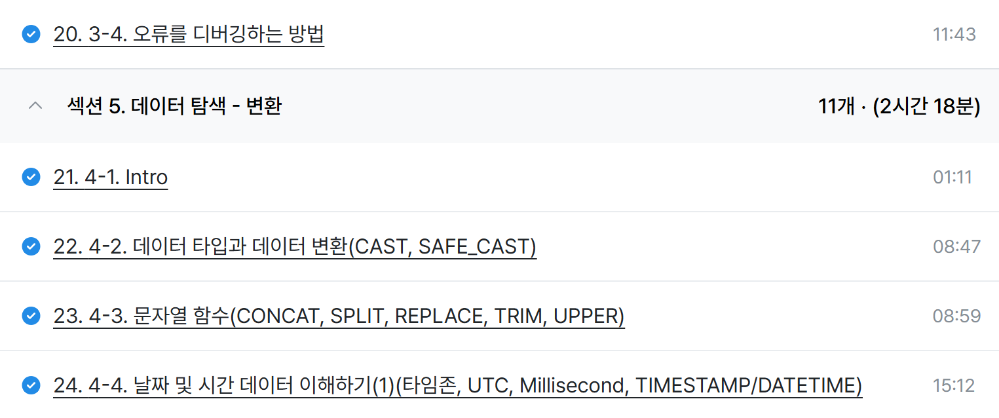

# SQL_BASIC 4주차 정규 과제 

📌SQL_BASIC 정규과제는 매주 정해진 분량의 `초보자를 위한 BigQuery(SQL) 입문` 강의를 듣고 간단한 문제를 풀면서 학습하는 것입니다. 이번주는 아래의 **SQL_Basic_4th_TIL**에 나열된 분량을 수강하고 `학습 목표`에 맞게 공부하시면 됩니다.

**4주차 과제부터는 강의 내용을 정리하는 것과 함께, 프로그래머스에서 제공하는 SQL 문제를 직접 풀어보는 실습도 병행합니다.** 강의에서는 **배운 내용을 정리하고 주요 쿼리 예제를 정리**하며, 프로그래머스 문제는 **직접 풀어본 뒤 풀이 과정과 결과, 배운 점을 함께 기록**해주세요. 완성된 과제는 Github에 업로드하고, 링크를 스프레드시트 'SQL' 시트에 입력해 제출해주세요.

**(수행 인증샷은 필수입니다.)** 

## SQL_BASIC_4th

### 섹션 4. 쿼리 잘 작성하기, 쿼리 작성 템플릿 및 오류를 잘 디버깅하기

### 3-4. 오류를 잘 디버깅하는 방법

## 섹션 5. 데이터 탐색 - 변환

### 4-1. INTRO

### 4-2. 데이터 타입과 데이터 변환(CAST, SAFE_CAST)

### 4-3. 문자열 함수(CONCAT, SPLIT, REPLACE, TRIM, UPPER)

### 4-4. 날짜 및 시간 데이터 이해하기(1) (타임존, UTC, Millisecond, TIMESTAMP/DATETIME)

## 🏁 강의 수강 (Study Schedule)

| 주차  | 공부 범위              | 완료 여부 |
| ----- | ---------------------- | --------- |
| 1주차 | 섹션 **1-1** ~ **2-2** | ✅         |
| 2주차 | 섹션 **2-3** ~ **2-5** | ✅         |
| 3주차 | 섹션 **2-6** ~ **3-3** | ✅         |
| 4주차 | 섹션 **3-4** ~ **4-4** | ✅         |
| 5주차 | 섹션 **4-4** ~ **4-9** | 🍽️         |
| 6주차 | 섹션 **5-1** ~ **5-7** | 🍽️         |
| 7주차 | 섹션 **6-1** ~ **6-6** | 🍽️         |

 

<!-- 여기까진 그대로 둬 주세요-->

---

# 1️⃣ 개념정리

## 3-4. 오류를 디버깅하는 방법

~~~
✅ 학습 목표 :
* 오류의 정의에 대해 설명할 수 있다. 
* 오류 메시지를 보고 디버깅이라는 과정을 수행할 수 있다. 
~~~

<!-- 새롭게 배운 내용을 자유롭게 정리해주세요.-->

오류 메세지가 알려주고자 하는 것
- 길잡이 역할
- 문제 진단

< 대표적인 오류 >

Syntax Error (문법 오류)

: 문법을 지키지 않아 생기는 오류

[ 해결 방법 ]
1. Chat GPT에 질문
2. 구글에 검색
3. 지인에게 질문

보통 밑줄(__) 앞 or 뒤에 생기는 오류
~~~
[0:1] = [줄:칸]
~~~

📌 집계함수 `COUNT`의 인자 수는 하나만 들어감

오류 - SELECT list expression references column type1 a which is neither grouped nor aggregated 

: SELECT 목록 식은 다음에서 그룹화되거나 집계되지 않은 열을 참조

-> GROUP BY에 적절한 컬럼을 명시하지 않았을 경우 발생하는 오류

## 4-2. 데이터 타입과 데이터 변환(CAST, SAFE_CAST)

~~~
✅ 학습 목표 :
* 데이터 타입의 종류를 설명할 수 있다. 
* 데이터 타입을 변환하는 방법을 설명할 수 있다. 
~~~

<!-- 새롭게 배운 내용을 자유롭게 정리해주세요.-->

< 사용 >

SELECT문, WHERE의 조건문
~~~
[ 데이터 타입 ]

- 숫자 : 정수, 실수
- 문자 : " "
- 시간, 날짜 : 2024-01-01, 2024-01-01 23:59:10
- Bool : 참, 거짓
~~~
< 중요한 이유 >

엑셀에서 빈 값 -> " " or NULL

∴ 보이는 것과 저장된 것의 차이가 존재할 수 있기 때문에 주의해야 함

자료 타입을 변경하는 함수 : CAST
- CAST (1 AS STRING) : 숫자 1을 문자 1로 변경

더 안전하게 데이터 타입 변경 : SAFE_CAST

📌 CAST vs SAFE_CAST

CAST : 변환 실패 시, 오류를 반환

SAFE_CAST : 변환 실패 시, NULL 반환

- 나눗셈도 동일 = SAFE_DIVIDE(x, y) 사용

## 4-3. 문자열 함수(CONCAT, SPLIT, REPLACE, TRIM, UPPER)

~~~
✅ 학습 목표 :
* 문자열 함수들의 종류를 이해하고 어떠한 상황에서 사용하는지 설명할 수 있다. 
~~~

<!-- 새롭게 배운 내용을 자유롭게 정리해주세요.-->

[ 문자열 함수 ]

### CONCAT 

: 문자열 붙이기

- 문법 : CONCAT(칼러1, 칼럼2, ...)
~~~
SELECT
	CONCAT("안녕", "하세요") AS result
~~~
> 안녕하세요

### SPLIT (쪼개다)

: 문자열 분리하기

- 문법 : SPLIT(문자열 원본, 나눌 기준이 되는 문자)
~~~
SELECT
	SPLIT("가, 나, 다, 라", ", ") AS result
~~~
>가

>나

>다

>라

**결과 : 배열 형태**

### REPLACE (치환하다)

: 특정 단어 수정하기

- 문법 : REPLACE(문자열 원본, 찾을 단어, 바꿀 단어)
~~~
SELECT
	REPLACE("안녕하세요", "안녕", "실천") AS result
~~~
> 실천하세요

### TRIM(자르다)
: 문자열 자르기

- 문법 : TRIM(문자열 원본, 자를 단어)
~~~
SELECT
	TRIM("안녕하세요", "하세요") AS result
~~~
> 안녕

### UPPER
: 영어 대문자 변환

- 문법 : UPPER(문자열 원본)
~~~
SELECT
	UPPER('abc') AS result
~~~
> ABC

## 4-4. 날짜 및 시간 데이터 이해하기(1) (타임존, UTC, Millisecond, TIMESTAMP/DATETIME)

~~~
✅ 학습 목표 :
* 날짜 및 시간 데이터 타입과 UTC의 개념을 설명할 수 있다. 
* DATE, DATETIME, TIMESTAMP 에 대해서 설명할 수 있다.
* 시간함수들의 종류와 시간의 차이를 추출하는 방법을 설명할 수 있다. 
~~~

<!-- 새롭게 배운 내용을 자유롭게 정리해주세요.-->

[ 시간데이터 ]

### DATE 
: 날짜만 표시 23-12-31

### DATETIME 
: 날짜 + 시간 표시하는 데이터 23-12-31T14:00:00 (TIME ZONE 정보 X)
	
- T : TIME을 의미

### TIME 
: 시간만 표시 14:00:00

📌 타임존

한국 시간 : GMT(Greenwich Mean Time) +9
- 영국의 그리니치 천문대(경도 0도 - 세로선)를 기준으로 지역에 따른 시간의 차이를 조정하기 위해 생긴 시간의 구분선

요즘 추세 
UTC : Universal Time Coordinated 
한국시간 : UTC+9
- 국제적인 표준 시간
- GMT와는 경미한 차이

*타임존이 존재한다 = 특정 지역의 표준 시간대 O*

### TIMESTAMP
- 시간 도장
- UTC부터 경과한 시간을 나타내는 값
- TIME ZONE 정보 있음

    EX. 2023-12-31 14:00:00 UTC

### millisecond(ms)
- 천 분의 1초(1,000ms = 1초)

### microsecond
- 천 ms의 1(1/1,000,000초)

📌 쿼리를 짤 때

 Millisecond -> TIMESTAMP -> DATETIME
~~~
SELECT
	DATETIME(TIMESTAMP_MILLIS(1704176819711), 'Asia/Seoul') AS datetime_value
~~~
* Asia/Seoul을 넣었는지 꼭 체크해주기

-> 미지정 시 국제 표준시(UTC) 기준으로 시간대 편성 (한국 시간 : +9)

▶ TIMESTAMP는 한국 시간 -9시간(UTC로 나오기 때문)

 

 

---

# 2️⃣ 확인문제 & 문제 인증

## 프로그래머스 문제 

> 조건에 맞는 회원 수 구하기 (SELECT, COUNT) 
>
> **먼저 문제를 풀고 난 이후에 확인 문제를 확인해주세요**
>
> 문제 링크 
>
> :  https://school.programmers.co.kr/learn/courses/30/lessons/131535#

## 문제 1

> **🧚Q. 프로그래머스 문제를 풀던 서현이는 여러 번의 시행착오 끝에 결국 혼자 해결하기 어려워 오류 메시지를 공유하며 도움을 요청했습니다. 여러분들이 오류 메시지를 확인하고, 해당 SQL 쿼리에서 어떤 부분이 잘못되었는지 오류 메시지를 해석하고 찾아 설명해주세요.**

~~~sql
# 조건에 맞는 회원 수 구하기 (SELECT, COUNT) 
# 서현이의 SQL 첫 번째 풀이
SELECT COUNT(AGE, JOINED)
FROM USER_INFO
WHERE AGE BETWEEN 20 AND 29
  AND JOINED BETWEEN '2021-01-01' AND '2021-12-31';
  
오류 메시지 : Error: Number of arguments does not match for aggregate function COUNT
 
# 수정하고 난 이후 두 번째 풀이
SELECT AGE, COUNT(*)
FROM USER_INFO
WHERE AGE BETWEEN 20 AND 29
  AND JOINED BETWEEN '2021-01-01' AND '2021-12-31';
  
오류 메시지 : SELECT list expression references column AGE which is neither grouped nor aggregated
~~~

~~~
첫 번째 오류 : COUNT()를 사용할 때, 함수 안에 들어가는 인수의 개수가 잘못되었다.

두 번째 오류 : 전체 그룹을 요약하는 값(집계 함수)과 개별 항목(일반 컬럼)을 한 번에 보여달라고 요구해서 생기는 충돌

SELECT AGE, COUNT(*)
FROM USER_INFO
WHERE AGE BETWEEN 20 AND 29
  AND JOINED BETWEEN '2021-01-01' AND '2021-12-31'
GROUP BY AGE

하지만 문제에서 요구하는 것은 2021년에 가입한 회원 중 나이가 20세 이상 29세 이하인 회원이 총 몇 명인지 구하는 것이기 때문에 

SELECT COUNT(USER_ID) AS USERS
FROM USER_INFO
WHERE AGE BETWEEN 20 AND 29
  AND JOINED BETWEEN '2021-01-01' AND '2021-12-31'

이렇게 작성해야 한다.
~~~

### 🎉 수고하셨습니다.