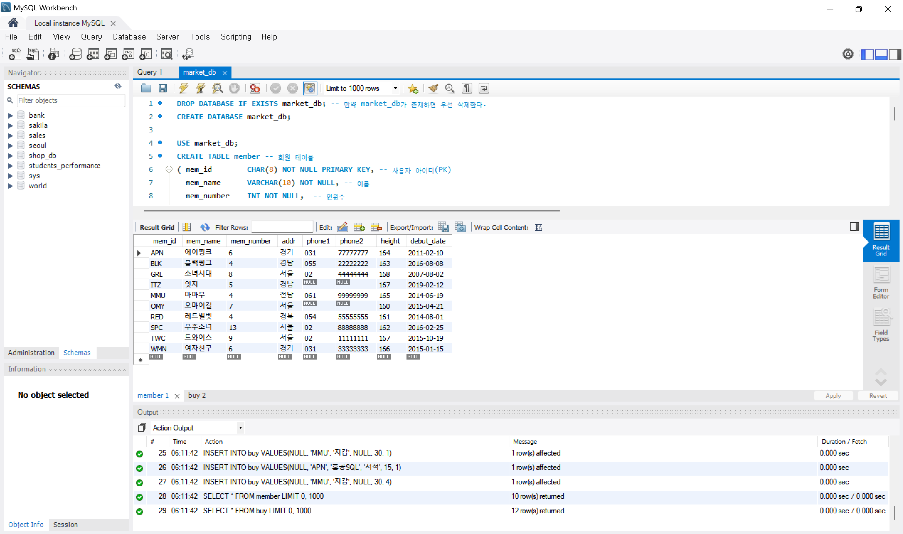
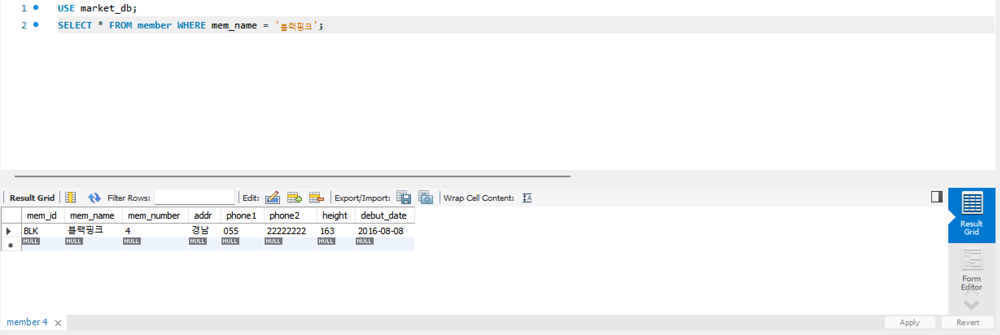
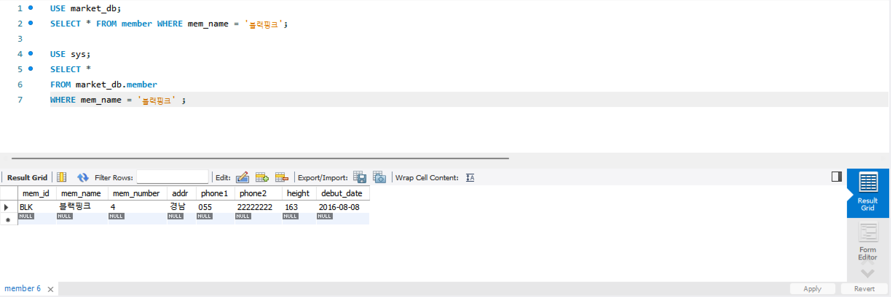
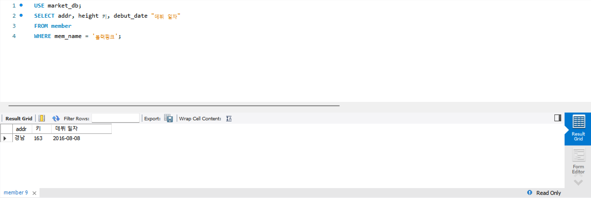
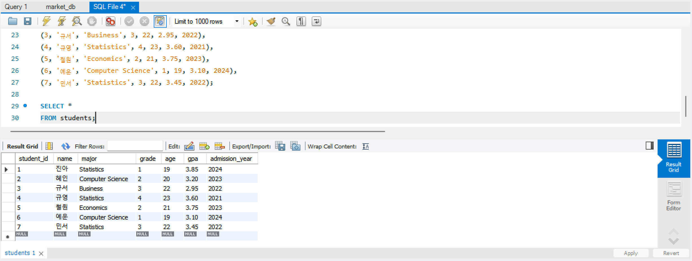
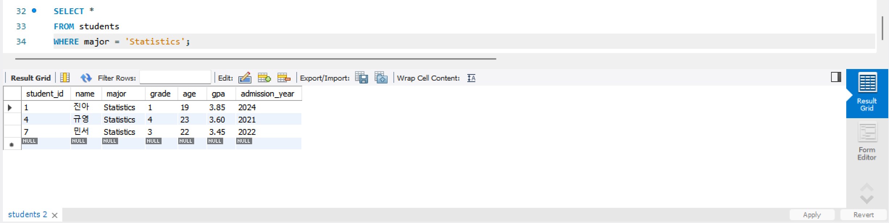
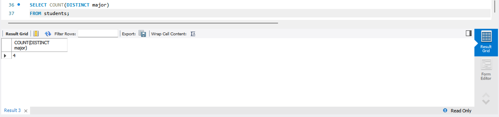
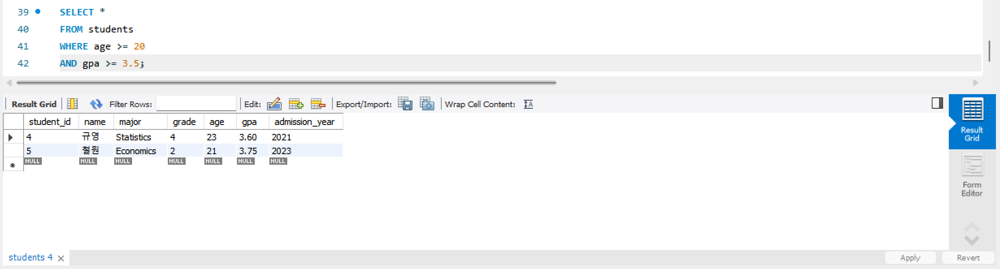
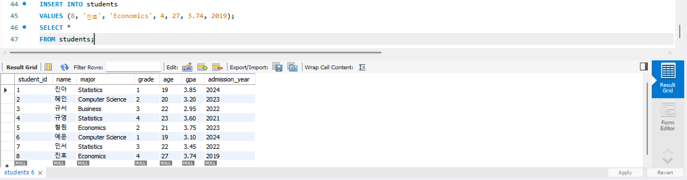

# SQL_ADVANCED 2주차 정규 과제 

📌SQL_ADVANCED 정규과제는 매주 정해진 분량의 『*혼자 공부하는 SQL*』 을 읽고 학습하는 것입니다. 이번주는 아래의 **SQL_ADVANCED_2nd_TIL**에 나열된 분량을 읽고 공부하시면 됩니다.

아래의 문제를 풀어보며 학습 내용을 점검하세요. 문제를 해결하는 과정에서 개념을 스스로 정리하고, 필요한 경우 제시된 강의를 참고하여 보완하는 것이 좋습니다.

<!-- 강의 링크는 아래와 같습니다.
https://www.youtube.com/watch?v=_JURyg_KzHE&list=PLVsNizTWUw7GCfy5RH27cQL5MeKYnl8Pm&index=7
https://www.youtube.com/watch?v=6qkPy7RfLqQ&list=PLVsNizTWUw7GCfy5RH27cQL5MeKYnl8Pm&index=8
https://www.youtube.com/watch?v=WWAFAm9op2U&list=PLVsNizTWUw7GCfy5RH27cQL5MeKYnl8Pm&index=9
-->

**교재 실습 예제 파일은 07_SQL_ADVANCED_Template 레포지토리의 src 폴더에 업로드되어 있습니다. market_db 파일도 해당 폴더에 함께 포함되어 있으니 참고하시기 바랍니다.**

**👀(수행 인증샷은 필수입니다.)** 

## SQL_ADVANCED_2nd_TIL

### 3장 SQL 기본 문법
#### 01. 기본 중에 기본 SELECT ~ FROM ~ WHERE
#### 02. 좀 더 깊게 알아보는 SELECT문
#### 03. 데이터 변경을 위한 SQL문


## Study Schedule

| 주차  | 공부 범위     | 완료 여부 |
| ----- | ------------- | --------- |
| 1주차 | p.24~99    | ✅         |
| 2주차 | p.102~155   | ✅         |
| 3주차 | p.158~213  | 🍽️         |
| 4주차 | p.216~271 | 🍽️         |
| 5주차 | p.274~327 | 🍽️         |
| 6주차 | p.330~369 | 🍽️         |
| 7주차 | p.372~407 | 🍽️         |


<br>

<!-- 여기까진 그대로 둬 주세요-->

---

# 1️⃣ 학습 내용 정리

## 1. 기본 중에 기본 SELECT ~ FROM ~ WHERE

### 1-1. 사용할 데이터베이스 지정: `USE`
* **개념 :** SELECT 문을 실행하기 전, 먼저 어떤 데이터베이스를 사용할 것인지 지정해야 합니다.
* **문법 :** `USE 데이터베이스_이름;`.
* **특징 :** 한 번 지정해 놓으면 다시 USE 문을 사용하거나 다른 DB를 사용하겠다고 명시하지 않는 이상 모든 SQL 문은 해당 데이터베이스에서 수행됩니다.

### 1-2. 기본 데이터 조회 : `SELECT ~ FROM`
* **개념 :** 구축이 완료된 테이블에서 데이터를 추출하는 기능을 합니다. 기존 데이터가 변경되지는 않습니다.
* **기본 문법 :** `SELECT 열_이름 FROM 테이블_이름;`.
* **모든 열 조회 :** 열 이름 대신 `*`(별표)를 사용하면 테이블의 모든 열을 가져옵니다.
* **특정 열 조회 :** 여러 개의 열을 가져오고 싶으면 콤마(,)로 구분하여 나열합니다.
* **별칭(Alias) 지정 :** 조회된 결과의 열 이름에 별칭을 지정할 수 있습니다. 열 이름 뒤에 별칭을 입력하며, 별칭에 공백이 있다면 큰따옴표(" ")로 묶어줍니다.
  * *예시 :* `SELECT addr 주소, debut_date "데뷔 일자" FROM member;`

### 1-3. 특정한 조건만 조회하기 : `WHERE`
* **개념 :** 테이블의 전체 행을 가져오는 대신, 특정 조건에 부합하는 데이터만 골라서 보고 싶을 때 사용합니다.
* **기본 문법 :** `SELECT 열_이름 FROM 테이블_이름 WHERE 조건식;`.
* **조건식에 사용되는 연산자:**
  * **관계 연산자 :** 크다, 작다, 같다 등을 비교할 때 사용합니다. (`<`, `<=`, `>`, `>=`, `=`).
  * **논리 연산자 :** 2가지 이상의 조건을 엮을 때 사용하며, 두 조건이 모두 참이어야 하는 `AND`와 하나만 참이어도 되는 `OR`가 있습니다.

### 1-4. WHERE 절을 돕는 유용한 조건 구문
* **`BETWEEN ~ AND`:** 숫자로 구성된 데이터가 특정 범위 내에 있는지 검색할 때 사용합니다 (예: 키가 163 이상 165 이하).
* **`IN()`:** 문자로 구성된 데이터가 여러 값 중 하나에 해당하는지 검색할 때 사용합니다. 여러 개의 `OR` 조건을 `IN('경기', '전남', '경남')`처럼 간결하게 작성할 수 있습니다.
* **`LIKE`:** 문자열의 일부 글자만으로 검색할 때 사용합니다.
  * `%`: 무엇이든(글자 수 상관없음) 허용한다는 의미입니다 (예: `우%` -> '우'로 시작하는 모든 문자).
  * `_`: 한 글자와 매치한다는 의미입니다 (예: `__핑크` -> 앞에 두 글자가 있고 뒤에 '핑크'로 끝나는 네 글자 문자).

### 1-5. 쿼리 안의 쿼리 : 서브 쿼리(Subquery)
* **개념 :** `SELECT` 문장 안에 또 다른 `SELECT` 문장이 들어가는 구조를 서브 쿼리(또는 하위 쿼리)라고 부릅니다.
* **활용 :** 특정 값을 직접 알아내어 조건식에 적는 대신, 그 값을 찾아내는 쿼리문을 괄호로 묶어 조건식에 포함시킵니다.
  * *예시 :* 에이핑크의 평균 키보다 큰 회원을 찾을 때, 에이핑크의 키(164)를 직접 입력하지 않고 서브 쿼리로 작성.
  * `SELECT mem_name, height FROM member WHERE height > (SELECT height FROM member WHERE mem_name = '에이핑크');`.
* **장점 :** 2개의 쿼리를 하나로 만들어 주므로 쿼리문 관리가 단일해지고 실무에서도 종종 사용됩니다.

<!-- 이번 챕터에서 제시된 실습을 흐름에 맞게 진행한 후, 실습 과정이 보일 수 있도록 인증 사진을 3~4장 제출해 주세요. -->






> **확인문제: 다음 SQL문의 빈칸에 들어갈 WHERE절의 문법으로 틀린 것을 고르세요.**

```sql
SELECT *
FROM table_name
WHERE ________;
```

보기는 아래와 같습니다.
```
1. mem_number == 4
2. mem_number >= 4
3. mem_number <= 4
4. mem_number = 4
```

```
1번 mem_number == 4
SQL에서는 같음을 비교할 때 == 가 아니라 = 를 사용하므로 틀린 문법
```


## 2. 좀 더 깊게 알아보는 SELECT문

### 2-1. 결과를 정렬하는 `ORDER BY` 절
`ORDER BY` 절은 조회된 결과가 출력되는 순서를 조절하는 역할을 합니다. 데이터의 값이나 개수에는 영향을 미치지 않고, 오직 보여주는 순서만 변경합니다.

* **정렬 기준 (오름차순 / 내림차순)**
  * **`ASC` (Ascending) :** 오름차순 정렬을 의미하며, 기본값이기 때문에 생략해도 무방합니다.
  * **`DESC` (Descending) :** 내림차순 정렬을 의미합니다.
* **여러 열을 기준으로 정렬 :** 정렬 기준은 1개가 아니라 여러 개의 열로 지정할 수 있습니다. 
  * *예시 :* `ORDER BY height DESC, debut_date ASC` (키가 큰 순서대로 먼저 정렬하고, 키가 같다면 데뷔 일자가 빠른 순서대로 정렬).
* **⚠️ 주의사항 (SQL 구문의 순서) :** `ORDER BY` 절은 반드시 `WHERE` 절 다음에 나와야 합니다. 순서가 틀리면 오류가 발생합니다.

### 2-2. 데이터를 묶어주는 `GROUP BY` 절
`GROUP BY` 절은 지정한 열의 데이터들을 같은 데이터끼리 묶어서 결과를 추출할 때 사용합니다. 주로 합계, 평균, 개수 등을 처리하기 위해 집계 함수(Aggregate Function)와 함께 사용됩니다.

* **주요 집계 함수**
  * `SUM()`: 합계를 구합니다.
  * `AVG()`: 평균을 구합니다.
  * `MIN()` / `MAX()`: 최소값 / 최대값을 구합니다.
  * `COUNT()`: 행의 개수를 셉니다.
  * `COUNT(DISTINCT)`: 중복은 1개만 인정하여 행의 개수를 셉니다.
* **그룹화 조건 제한 (`HAVING` 절)**
  * 집계 함수를 사용한 조건은 `WHERE` 절에 작성할 수 없습니다 (오류 발생).
  * 그룹화된 데이터에 조건을 주려면 `WHERE` 대신 **`HAVING` 절**을 사용해야 합니다.
  * **⚠️ 주의사항 :** `HAVING` 절은 반드시 `GROUP BY` 절의 바로 뒤에 나와야 합니다.

---

### 💡 SQL 문의 전체 작성 순서

1. `SELECT` (가져올 열 지정)
2. `FROM` (조회할 테이블 지정)
3. `WHERE` (조회할 데이터의 조건)
4. `GROUP BY` (특정 열을 기준으로 그룹화)
5. `HAVING` (그룹화된 데이터의 조건)
6. `ORDER BY` (결과 출력 순서 정렬)

> **확인문제: 다음 표는 주요 집계함수를 정리한 것입니다. 각 설명에 해당하는 올바른 함수명을 기호에 맞게 작성하세요.**

| 함수명 | 설명 |
|--------|------|
| SUM() | 합계를 구합니다. |
| (ㄱ) | 평균을 구합니다. |
| (ㄴ) | 최소값을 구합니다. |
| MAX() | 최대값을 구합니다. |
| (ㄷ) | 행의 개수를 셉니다. |
| (ㄹ) | 행의 개수를 셉니다 (중복은 1개만 인정). |

```
(ㄱ) AVG()
(ㄴ) MIN()
(ㄷ) COUNT()
(ㄹ) COUNT(DISTINCT)
```


## 3. 데이터 변경을 위한 SQL문

### 3-1. 데이터 입력: `INSERT`
테이블에 새로운 행 데이터를 입력(삽입)할 때 사용하는 기본적인 구문입니다.

* **기본 문법 :** `INSERT INTO 테이블_이름 [(열1, 열2, ...)] VALUES (값1, 값2, ...)`.
* **주요 특징:**
  * **열 이름 생략 :** 테이블 이름 뒤의 열 이름은 생략 가능합니다. 단, 생략할 경우 `VALUES` 뒤의 값들은 테이블을 정의할 때의 열 순서 및 개수와 똑같이 맞춰서 입력해야 합니다.
  * **자동 증가 (`AUTO_INCREMENT`) :** 1부터 증가하는 값을 자동으로 입력해 주는 기능입니다. 이 열은 반드시 기본 키(PRIMARY KEY)로 지정해야 하며, 데이터 입력 시 해당 자리에 `NULL`이라고 적어주면 시스템이 알아서 숫자를 채워줍니다. `ALTER TABLE`로 시작값을 변경하거나 증가폭을 바꿀 수도 있습니다.
  * **여러 건 한 번에 입력 :** `VALUES (값1, 값2), (값3, 값4)`처럼 콤마로 이어 붙여 여러 줄의 데이터를 단 한 줄의 코드로 간편하게 입력할 수 있습니다.
  * **대량 데이터 가져오기 :** `INSERT INTO ~ SELECT` 구문을 사용하면 다른 테이블에 이미 저장된 많은 양의 데이터를 한 번에 가져와서 내 테이블에 밀어 넣을 수 있습니다.

### 3-2. 데이터 수정 : `UPDATE`
기존에 입력되어 있는 데이터 값을 변경해야 할 때 사용합니다.

* **기본 문법 :** `UPDATE 테이블_이름 SET 열1=값1, 열2=값2 WHERE 조건;`.
* **주요 특징**
  * 콤마(,)를 분리 기호로 사용하여 여러 개의 열 값을 한꺼번에 변경할 수 있습니다.
  * 연산 수식을 적용할 수 있습니다. (예: `SET population = population / 10000` 처럼 기존 인구수를 만 단위로 나누어 수정).
* **⚠️ 주의사항 (WHERE 절 생략) :** `UPDATE` 문에서 조건식인 `WHERE` 절은 생략이 가능하지만, 만약 **생략할 경우 테이블에 있는 모든 행의 값이 통째로 변경**되는 대참사가 일어날 수 있으므로 각별히 주의해야 합니다.

### 3-3. 데이터 삭제 : `DELETE`
테이블에 있는 행 데이터를 지워야 할 때 사용합니다.

* **기본 문법 :** `DELETE FROM 테이블_이름 WHERE 조건;`.
* **주요 특징**
  * `UPDATE`와 마찬가지로 `WHERE` 절을 생략하면 테이블 내의 **전체 행 데이터가 삭제**됩니다.
  * 삭제할 조건을 작성한 후 제일 뒤에 `LIMIT 5`와 같이 추가하면, 조건에 맞는 것 중 상위 5건만 삭제되도록 제한할 수도 있습니다.
* **💡 대용량 테이블 삭제 꿀팁 :** 수백만 건 이상의 대용량 데이터를 삭제할 때는 명령어마다 속도와 결과가 다릅니다.
  * **`DELETE`:** 데이터를 한 줄씩 지우기 때문에 시간이 매우 오래 걸립니다.
  * **`DROP`:** 데이터뿐만 아니라 테이블 자체(껍데기)를 아예 날려버리며, 삭제 속도가 엄청나게 빠릅니다.
  * **`TRUNCATE`:** `DELETE`처럼 데이터를 모두 삭제하되 테이블의 구조(빈 껍데기)는 남겨둡니다. 조건(`WHERE`)을 줄 수는 없지만, 전체 데이터를 지울 때는 `DELETE`보다 속도가 훨씬 빠르므로 효율적입니다.

---

### 💡 [요약] 한눈에 보는 데이터 변경 키워드
| 구문 / 용어 | 역할 및 설명 |
| :--- | :--- |
| **INSERT** | 테이블에 데이터를 삽입하는 명령 |
| **UPDATE** | 기존에 입력되어 있는 값을 수정하는 명령 (주로 WHERE와 함께 사용) |
| **DELETE** | 행 단위로 데이터를 삭제하는 명령 (WHERE가 없으면 전체 행 삭제) |
| **AUTO_INCREMENT** | 1부터 증가하는 값을 자동으로 입력해 줌 (PK 지정 필수) |
| **TRUNCATE** | DELETE와 기능은 비슷하지만 조건 없이 전체 데이터를 매우 빠르게 삭제할 때 사용 |

> **확인문제: 다음이 설명하는 SQL이 무엇인지 쓰세요.**

```
* 데이터를 삭제합니다.
* DELETE와 동일한 효과를 내지만 속도가 무척 빠릅니다.
* 삭제 후에 빈 테이블이 남아 있습니다.
```

```
TRUNCATE
```


---

# 2️⃣ 실습과제

## 1. 데이터베이스 구축

아래 코드를 MySQL Workbench에 붙여넣은 후,  
**전체 드래그 → 실행 (Ctrl + shift + Enter)** 하여 데이터베이스를 구축하세요.

```sql
-- 1. 데이터베이스 생성
CREATE DATABASE IF NOT EXISTS week2_db;

-- 2. 사용할 데이터베이스 선택
USE week2_db;

-- 4. 테이블 생성
CREATE TABLE students (
    student_id INT PRIMARY KEY,
    name VARCHAR(20),
    major VARCHAR(30),
    grade INT,
    age INT,
    gpa DECIMAL(3,2),
    admission_year INT
);

-- 5. 데이터 삽입
INSERT INTO students VALUES
(1, '진아', 'Statistics', 1, 19, 3.85, 2024),
(2, '혜인', 'Computer Science', 2, 20, 3.20, 2023),
(3, '규서', 'Business', 3, 22, 2.95, 2022),
(4, '규영', 'Statistics', 4, 23, 3.60, 2021),
(5, '철원', 'Economics', 2, 21, 3.75, 2023),
(6, '예운', 'Computer Science', 1, 19, 3.10, 2024),
(7, '민서', 'Statistics', 3, 22, 3.45, 2022);
```
## 2. 실습 문제

다음 SQL 문을 작성하고 실행 결과를 확인 후 인증 사진을 아래에 업로드하세요.

1. 모든 학생의 정보를 조회하시오.


2. 전공이 'Statistics'인 학생을 조회하시오.


3. 현재 students 테이블에 존재하는 서로 다른 전공의 개수를 구하시오.


4. 나이가 20 이상이고 GPA가 3.5 이상인 학생을 조회하시오.


5. students 테이블에 본인의 정보를 직접 INSERT 하시오. (INSERT 실행 후, 데이터가 정상적으로 추가되었는지 확인할 수 있도록 조회 결과까지 포함하여 캡처하시오.)


### 🎉 수고하셨습니다.


