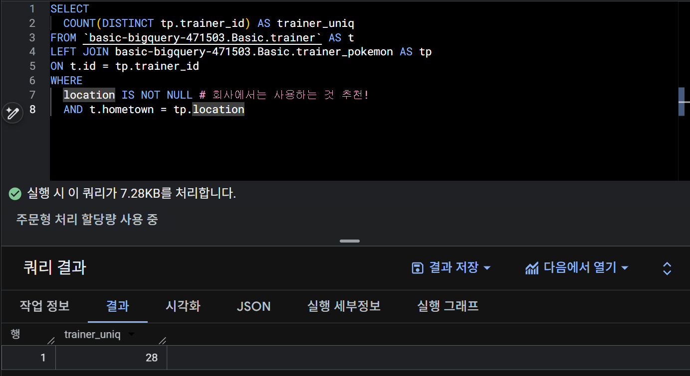

# SQL_BASIC 6주차 정규 과제 

📌SQL_BASIC 정규과제는 매주 정해진 분량의 `초보자를 위한 BigQuery(SQL) 입문` 강의를 듣고 간단한 문제를 풀면서 학습하는 것입니다. 이번주는 아래의 **SQL_Basic_6th_TIL**에 나열된 분량을 수강하고 `학습 목표`에 맞게 공부하시면 됩니다.

**6주차 과제는 강의 내용을 정리하는 것과 함께, 프로그래머스에서 제공하는 SQL 문제를 직접 풀어보는 실습도 병행합니다.** 강의에서는 **배운 내용을 정리하고 주요 쿼리 예제를 정리**하며, 프로그래머스 문제는 **직접 풀어본 뒤 풀이 과정과 결과, 배운 점을 함께 기록**해주세요. 완성된 과제는 Github에 업로드하고, 링크를 스프레드시트 'SQL' 시트에 입력해 제출해주세요.

**(수행 인증샷은 필수입니다.)** 

## SQL_BASIC_6th

### 섹션 6. 다량의 자료를 연결 : JOIN 

### 5-1. Intro

### 5-2. JOIN 이해하기

### 5-3. 다양한 JOIN 방법

### 5-4. JOIN 쿼리 작성하기 

### 5-5. JOIN을 처음 공부할 때 헷갈렸던 부분

### 5-6. JOIN 연습문제 1~2번

### 5-6. JOIN 연습문제 3~5번

### 5-7. 정리

## 🏁 강의 수강 (Study Schedule)

| 주차  | 공부 범위              | 완료 여부 |
| ----- | ---------------------- | --------- |
| 1주차 | 섹션 **1-1** ~ **2-2** | ✅         |
| 2주차 | 섹션 **2-3** ~ **2-5** | ✅         |
| 3주차 | 섹션 **2-6** ~ **3-3** | ✅         |
| 4주차 | 섹션 **3-4** ~ **4-4** | ✅         |
| 5주차 | 섹션 **4-4** ~ **4-9** | ✅         |
| 6주차 | 섹션 **5-1** ~ **5-7** | ✅         |
| 7주차 | 섹션 **6-1** ~ **6-6** | 🍽️         |

<!-- 여기까진 그대로 둬 주세요-->

 

---

# 1️⃣ 개념정리

## 5-2. JOIN 이해하기

~~~
✅ 학습 목표 :
* JOIN에 대한 정의와 필요성에 대해 설명할 수 있다.
~~~

### JOIN 정의

JOIN : 서로 다른 데이터 테이블(다량의 자료)을 연결하는 과정
	
- 두 데이터를 연결할 수 있는 공통 컬럼(=KEY)이 있어야 연결(=JOIN) 가능
		
    - TIP) XX_id있는지 확인 OR Date 확인
	
    - 여러 테이블 JOIN 가능

**JOIN에 익숙해지기 위한 방법**

테이블 저장된 형태 -> JOIN 후의 모습 -> 쿼리 실행 -> 결과

### JOIN 필요성

**데이터 저장되는 형태에 대한 이해**

관계형 데이터베이스(RDBMS) 설계시 정규화 과정을 거침
- 정규화 : 중복을 최소화하게 데이터 구조화

    -> 따라서 데이터를 다양한 Table에 저장해서 필요할 때 JOIN해서 사용

***개발 관점에서는 데이터가 분리되어 있는 것이 좋다.***

### 데이터 정규화의 필요성

: 데이터의 **효율성, 무결성, 관리의 용이성**을 높이기 위한 핵심적인 과정

### **정규화 과정은 데이터의 '효율화'를 위한 것**

정규화(Normalization)는 데이터베이스 설계에서 데이터를 **중복 없이 체계적으로 저장**하고, 데이터 간의 일관성(무결성)을 유지하기 위해 테이블을 여러 개로 분리하는 일련의 과정입니다.

| 목표 | 설명 | 효율화 측면 |
| :--- | :--- | :--- |
| **중복 최소화 (Redundancy Reduction)** | 같은 정보가 여러 곳에 저장되는 것을 방지합니다. | **저장 공간 절약** 및 데이터 관리의 단순화. |
| **데이터 무결성 유지** | 데이터 갱신(Update) 시, 모든 사본을 일일이 고칠 필요가 없어 데이터 불일치(Inconsistency) 오류를 방지합니다. | 데이터의 **정확성과 신뢰성** 확보. |
| **이상 현상 제거 (Anomaly)** | 삽입, 삭제, 갱신 시 발생하는 원치 않는 부작용(이상 현상)을 제거합니다. | 시스템 운영 및 **유지보수 비용 감소**. |

### **'분리'가 개발 관점에서 좋은 이유**

개발 관점에서 데이터가 여러 테이블로 분리(정규화)되어 있는 것이 좋다고 하는 이유는 다음과 같습니다.

1.  **유연한 갱신 (Update Flexibility)**: 만약 '고객 주소'가 여러 테이블에 중복 저장되어 있다면, 주소가 바뀔 때마다 모든 테이블을 수정해야 합니다. 분리되어 있으면 주소 테이블의 한 행만 수정하면 됩니다.

2.  **쉬운 확장 (Scalability)**: 새로운 정보가 추가될 때, 기존 테이블 구조를 복잡하게 변경하는 대신 새로운 테이블을 추가하거나 기존 테이블에 컬럼 몇 개만 추가하면 됩니다.

3.  **성능 향상 (Performance)**: 데이터가 적절히 분리되면, 특정 정보를 검색할 때 **필요한 데이터만 있는 작은 테이블**에 빠르게 접근할 수 있어 검색 효율이 높아집니다. (물론 조인(JOIN) 횟수가 늘어나 검색 속도가 느려지는 트레이드오프도 있지만, 일반적으로 데이터 무결성이 더 중요합니다.)

---

### 요즘 추세

데이터 웨어하우스(=창고)에서 JOIN + 필요한 연산+가공(일자별, 타입, 지역별, 주문건수, 매출)을 해서 "데이터 마트"를 만들어서 활용

## 5-3. 다양한 JOIN 방법

~~~
✅ 학습 목표 :
* JOIN 방법들의 종류를 설명할 수 있다. 
* 각 JOIN 방법들의 차이점에 대해서 설명할 수 있다. 
~~~
### (INNER) JOIN

두 테이블의 공통 요소만 연결

### LEFT/RIGHT (OUTER) JOIN

왼쪽/오른쪽 테이블 기준으로 연결

### FULL (OUTER) JOIN

양쪽 기준으로 연결

### CROSS JOIN

두 테이블의 각각의 요소를 곱하기

**JOIN 집합 관점**

**JOIN을 처음 공부할 때 헷갈렸던 부분**

1) 여러 Table을 연결할 수 있을까?
	- JOIN의 개수는 3~5개가 적당

## 5-4. JOIN 쿼리 작성하기 

~~~
✅ 학습 목표 :
* JOIN을 사용한 문법에 대해 이해하여 적용할 수 있다.
* JOIN 을 활용한 쿼리를 작성할 수 있다. 
~~~

### JOIN 쿼리 작성 흐름

1. 테이블 흐름 
    - 테이블에 저장된 데이터, 컬럼 확인

2. 기준 테이블 정의
- 가장 많이 참고할 기준 테이블 정의
	- Tip) Row수가 적으면서 내가 원하는 것을 다 포함

3. JOIN Key 찾기
    - 여러 Table과 연결할 Key(ON) 정리

4. 결과 예상하기
    - 결과 테이블을 예상해서 손, 엑셀로 작성 

5. 쿼리 작성 / 검증
    - 예상한 결과와 동일한 결과가 나오는지 확인

### JOIN 문법

FROM

LEFT JOIN

ON

-> SELECT / FROM / (JOIN) / WHERE / GROUP BY / ORDER BY
~~~
- INNER JOIN, LEFT/RIGHT JOIN, FULL JOIN : ON 필수 작성
- CROSS JOIN : ON 필수 X
~~~
[ 예시 ]

FROM table1 AS A

LEFT JOIN table2 AS B

ON A.key = B.key

**EXCEPT : 활용하면 _ 삭제 가능**

### 학습목표2 : JOIN 을 활용한 쿼리를 작성할 수 있다. 

SELECT
	
    tp.*,
	t.* EXCEPT(id)

FROM 

	basic.trainer_pokemon AS tp
LEFT JOIN 
    
    basic.trainer AS t

ON 
    
    tp.trainer_id = t.id

## 5-6. JOIN 연습문제 1~5번 

~~~
✅ 학습 목표 :
* 연습문제(3문제 이상) 푼 것들 정리하기
~~~

### 1. 트레이너가 보유한 포켓몬들은 얼마나 있는지 알 수 있는 쿼리를 작성해주세요.

### 2. 트레이너가 보유한 포켓몬들은 얼마나 있는지 알 수 있는 쿼리를 작성해주세요.

### 3. 트레이너의 고향(hometown)과 포켓몬을 포획한 위치(location)를 비교하여, 자신의 고향에서 포켓몬을 포획한 트레이너의 수를 계산해주세요. 
### 참고 : status 상관없이 구해주세요

 

 

---

# 2️⃣ 확인문제 & 문제 인증

## 프로그래머스 문제 

https://school.programmers.co.kr/learn/courses/30/lessons/164673

> 조건에 부합하는 중고거래 댓글 조회하기 (JOIN)

.png)
https://school.programmers.co.kr/learn/courses/30/lessons/144854

> 조건에 맞는 도서와 저자 리스트 출력하기 (JOIN)

.png)

---

# 3️⃣ 참고자료

JOIN 에 대해서 그림으로 쉽게 이해할 수 있는 자료들도 있어서 첨부합니다. 아래의 블로그도 학습할 때 같이 참고해주세요.

1. https://data-marketing-bk.tistory.com/entry/SQL-JOIN-%ED%95%9C-%EB%B0%A9%EC%97%90-%EC%A0%95%EB%A6%AC-%EA%B0%9C%EB%85%90%EB%B6%80%ED%84%B0-%EC%BD%94%EB%93%9C%EA%B9%8C%EC%A7%80-%EC%9D%B4%EA%B2%83%EB%A7%8C-%EB%B3%B4%EC%9E%90

2. https://velog.io/@wijoonwu/JOIN

 

### 🎉 수고하셨습니다.