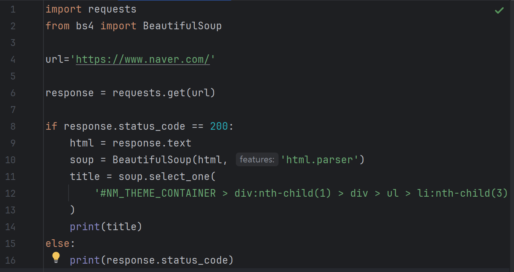
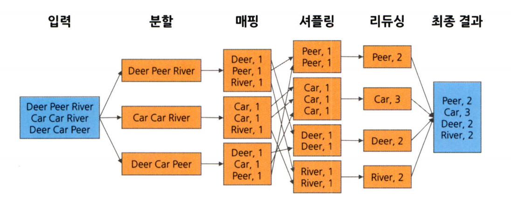
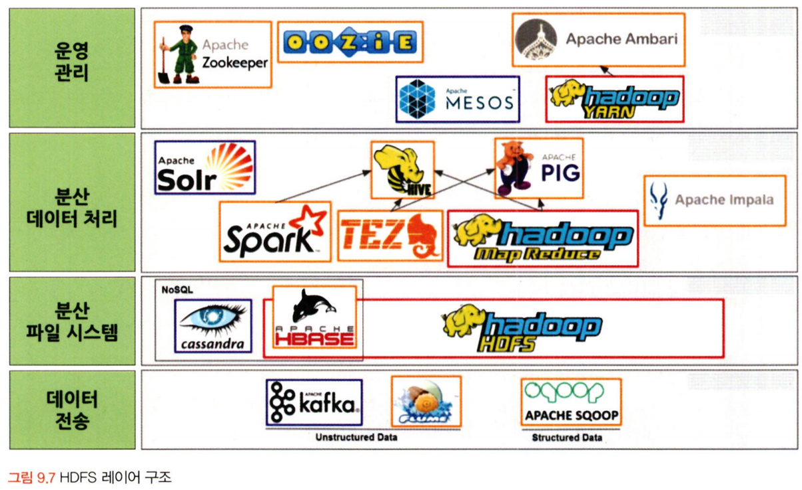
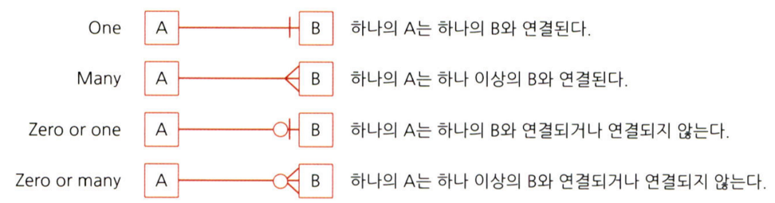

# 통계학 3주차 정규과제

📌통계학 정규과제는 매주 정해진 분량의 『*데이터 분석가가 반드시 알아야 할 모든 것*』 을 읽고 학습하는 것입니다. 이번 주는 아래의 **Statistics_3rd_TIL**에 나열된 분량을 읽고 `학습 목표`에 맞게 공부하시면 됩니다.

아래의 문제를 풀어보며 학습 내용을 점검하세요. 문제를 해결하는 과정에서 개념을 스스로 정리하고, 필요한 경우 추가자료와 교재를 다시 참고하여 보완하는 것이 좋습니다.

3주차는 `2부-데이터 분석 준비하기`를 읽고 새롭게 배운 내용을 정리해주시면 됩니다


## Statistics_3rd_TIL

### 2부. 데이터 분석 준비하기

### 08. 분석 프로젝트 준비 및 기획

### 09. 분석 환경 세팅하기


## Study ScheduleStudy Schedule

| 주차  | 공부 범위     | 완료 여부 |
| ----- | ------------- | --------- |
| 1주차 | 1부 p.2~46    | ✅         |
| 2주차 | 1부 p.47~81   | ✅         |
| 3주차 | 2부 p.82~120  | ✅         |
| 4주차 | 2부 p.121~167 | 🍽️         |
| 5주차 | 2부 p.168~202 | 🍽️         |
| 6주차 | 3부 p.203~250 | 🍽️         |
| 7주차 | 3부 p.251~299 | 🍽️         |

<!-- 여기까진 그대로 둬 주세요-->


# 1️⃣ 개념 정리 

## 08. 분석 프로젝트 준비 및 기획

```
✅ 학습 목표 :
* 데이터 분석 프로세스를 설명할 수 있다.
* 비즈니스 문제를 정의할 때 주의할 점을 설명할 수 있다.
* 외부 데이터를 수집하는 방법에 대해 인식한다.
```
<!-- 새롭게 배운 내용을 자유롭게 정리해주세요.-->

### 데이터 분석의 궁극적인 목표 
: 의사결정 프로세스를 최적화하는 것

-> 효과적인 결정을 할 수 있도록 도움을 주는 것

### [ 데이터 분석 프로젝트의 전체 프로세스 ]

**- 설계 단계** 

: 무엇을 하고자 하는지를 명확히 정의

- 문제 정의가 잘못되면 최종 인사이트 도출 및 솔루션 적용 단계에서 제대로 된 효과를 보기 힘들다.

    - MECE 기법('Mutually Exclusive, Collectively Exhaustive') : '서로 겹치지 않으면서 전체를 포괄하는' 분류 원칙을 말한다. 
    
        -> `로직 트리` 활용
	
    - 본질적인 문제점을 포함하는 문제 정의가 되어야 함.
		
        Ex. 약정기간이 끝난 고객들이 타 통신사로 이탈하여 `회사의 수익이 감소하고 있다.`

 

	페이오프 매트릭스(문제 해결 우선순위 결정 방식)


**- 분석 및 모델링 단계** 

: 데이터 분석 및 모델링을 위한 서버 환경을 마련하고 본격적인 데이터 분석과 모델링을 한다. 

Ex. CRISP-DM, SEMMA

**1. CRISP-DM 방법론**

- 1단계 : 비즈니스 이해

- 2단계 : 데이터 이해

- 3단계 : 데이터 준비

- 4단계 : 모델링

- 5단계 : 평가

- 6단계 : 배포

**2. SAS SEMMA 방법론**

- 1단계 : Sampling(데이터 추출)
	
- 2단계 : Exploration(데이터 탐색)
    - 상관분석, 클러스터링
		
    * `클러스터링` : 데이터를 비슷한 특성을 가진 그룹으로 묶는 것
	
- 3단계 : Modification(변수가공)
		
    - 로그변환, 구간화 등 데이터 가공
	
- 4단계 : Modeling(모델구축)
	
- 5단계 : Assessment(모델평가)

**[ 공통점 ]**

초반부 - 비즈니스 문제와 해결 방향을 명확히 정의하고 데이터 탐색

중반부 - 데이터를 목적에 맞도록 수집 및 가공 
+ 필요 시, 머신러닝 모델 사용

후반부 - 데이터 분석 결과를 검토 및 검증 & 실제 환경에 적용

**- 구축 및 활용 단계** 

: 최종적으로 선정된 분석 모델을 실제 업무에 적용하고 그 성과를 측정

### 분석 목적의 전환

데이터 탐색을 하기 전까지 데이터에 숨겨져 있는 정보와 인사이트를 확인하기 어렵다. 

-> 분석 프로젝트의 방향이 언제든 바뀔 수 있다는 것을 염두에 두어야 함

    Ex. 필터 교환 시기 예측 프로젝트 -> 원사의 절사 개선 프로젝트

### 도메인 지식

: 해당되는 분야의 업에 대한 이해도

    업종 단위 : 금융, 유통, 제조, 의료 정책 등

	하나의 기업

	하나의 조직 단위에 대한 이해도

*데이터 분석가에게 비즈니스 도메인에 대한 지식은 전문 역량 중 하나이다.*

### Tip. 도메인 지식을 효과적으로 습득하기 위해 어떻게 해야할까?

1. 프로젝트 초반, 실무자에게 적극적인 질문과 자료요청이 필수
	- 시각화 자료 활용 -> 동질감과 신뢰감 쌓기

2. 관련 논문들을 참고하여 해당 도메인에 대한 심도있는 지식 습득

3. 현장에 방문해 데이터가 만들어지는 과정을 직접 보는 것 

4. 소비자 혹은 사용자의 입장이 되어 경험을 해보는 것

### 외부데이터 수집 방법

1. MOU를 통한 데이터 공유

    - MOU(업무협약) : 두 개 이상의 기관, 회사 또는 나라가 서로 협력하기로 약속할 때 작성하는 문서
    (법적 구속력 X)

2. 공공 오픈 데이터 제공하는 사이트 활용
	- Kaggle

3. 크롤링 : 여러 웹 페이지를 탐색하고 수집하는 과정

- 실습



## 09. 분석 환경 세팅하기

```
✅ 학습 목표 :
* 데이터 분석의 전체적인 프로세스를 설명할 수 있다.
* 테이블 조인의 개념과 종류를 이해하고, 각 조인 방식의 차이를 구분하여 설명할 수 있다.
* ERD의 개념과 역할을 이해하고, 기본 구성 요소와 관계 유형을 설명할 수 있다.
```

<!-- 새롭게 배운 내용을 자유롭게 정리해주세요.-->

### 데이터 분석 언어


**SPSS** 

: 사회 과학을 위해 개발된 통계 프로그램

-> 대학 논문 작성에 주로 사용됨

**SAS** 

: 제품형 데이터 분석 솔루션

- `정확성`이 중요한 금융업계 기업들이 SAS를 많이 사용

- 프로그래밍 스킬이 부족한 사람도 데이터 분석 가능
- 데이터 시각화 ↑

> 단점

- 딥러닝, 인공신경망 분석에서 약한 모습
- 라이선스 비용 비쌈

**R**

: 오픈소스 데이터 분석용 언어

*통계학자들을 염두에 두고 만들어짐*

- 데이터 시각화 ↑
- Python에 비해 프로그래밍적 소양이 부족해도 사용 가능

**Python**

: C 언어로 구현된 프로그래밍 언어
- 문법이 쉽고 훨씬 간단
- 데이터 분석에 국한 X 

    - 웹서비스, 응용 프로그램, IOT 등 다양한 분야에서 사용

**SQL**

- 관계형 데이터베이스 시스템(RDBMS) 

    : 데이터베이스(DB)의 한 종류로, 데이터를 테이블(Table), 즉 행(Row)과 열(Column)로 구성된 2차원 형식으로 저장하고 관리하는 시스템을 말한다.

: RDBMS에서 데이터를 관리 및 처리하기 위해 설계된 언어

> 데이터 전처리 : SQL + Python 

~~~
2022년 기준

Python 1위 
SQL 9위 
R 11위
SAS 21위
~~~

### 데이터 처리 프로세스

**OLTP -> DW -> DM -> OLAP**

**OLTP** 

: 실시간으로 데이터를 트랜잭션 단위로 수집, 분류, 저장하는 시스템
	
- 트랜잭션 : 여러 개의 작업을 하나의 묶음으로 다루는 것

**DW(Data Warehouse)** 

: 데이터 창고
	
- 데이터들을 한 곳으로 취합하여 모아 놓은 저장소

**DM(Data Mart)**

: 사용자의 목적에 맞도록 가공된 일부의 데이터가 저장되는 곳

- Ex) 마케팅 팀, 인사 팀, 총무 팀 

    -> DW의 시스템 부하 ↓


**ETL** 
: Extract + Transform + Load

- Extract : 데이터를 읽어 들이는 과정

- Transform : 행 데이터를 정리, 필터링, 정형화하고 요약하여 분석에 적합한 상태로 바꾸는 과정
- Load : 새로운 테이블(목표 시스템)에 적재하는 과정

### 분산데이터 처리

: 한 컴퓨터가 처리해야 할 일을 여러 컴퓨터가 나눠서 한 다음 그 결과를 합치는 것

- scale-up : 컴퓨터의 용량을 늘리고 더 빠른 프로세서를 탑재하는 것

- scale-out : 여러 대의 컴퓨터를 병렬적으로 연결하는 것

    -> scale-out의 방식이 효율 ↑

**HDFS** 

: 여러 컴퓨터에 데이터를 나눠서 저장하는 분산 파일 시스템

**맵리듀스** 

: HDFS에 저장된 방대한 양의 데이터를 처리하기 위한 프로그래밍 모델

- KEY-VALUE 쌍으로 데이터 처리
	- 분할 -> 매핑 -> 셔플링 -> 리듀싱



### 하둡 1.0 Vs 2.0

1.0 : HDFS + 맵리듀스

2.0 : HDFS + 맵리듀스 + YARN(분산 리소스관리자)

- YARN을 통해 대량의 클러스터와 태스크를 동시에 효율적으로 처리 가능하게 됨


**물리적 구성**
노드 : 하나의 컴퓨터
랙 : 몇 개의 컴퓨터가 모인 것
클러스터 : 랙이 모인 것

**시스템적 구성**
클라이언트 -> 잡 -> 태스크 실행 -> 맴과 리듀스를 통해 분산 처리



**아파치 스파크**

: 데이터 분석 환경 구축하는 기업↑

- HDFS에서 분산 데이터 처리하는 하나의 시스템

- 데이터 과학자, 데이터 분석가들이 효율적으로 일할 수 있도록 특화된 환경을 가지고 있다.

- OLAP 작업에 특화됨

### 테이블 조인(JOIN)
: 2개 이상의 테이블을 공통의 컬럼을 중심으로 결합하는 것

**LEFT JOIN & RIGHT JOIN**

: 기준이 되는 테이블의 데이터는 그대로 유지 + 조인하는 테이블의 데이터만 추가되는 조인 방법

**INNER JOIN**

: 두 테이블에 모두 존재하며 일치하는(겹치는) 행만 가져오는 조인 방법

**FULL JOIN**

: 모든 행을 살리는 조인 방법

**CROSS JOIN**

: 모든 행을 조합하여 연결하는 조인 방법(Cartesian Product)

- 머신러닝에 사용되는 데이터셋을 생성할 때 사용

### 데이터 단어 사전
: 컬럼과 테이블의 이름을 정할 때 체계를 약속한 일종의 사전


### ERD (Entity Relationship Diagram) 

: 각 테이블의 구성 정보와 테이블 간 관계를 도식으로 표현한 그림 형태로 구성

- 'ERWin'이라는 프로그램 많이 사용

- 테이블 = `엔터티(Entity)`라고 불림

**기본 키**

: 데이터를 유일하게 구분하는 키
- 결측값 X
- 중복 X

**외래 키**

: 연결을 만들기 위해 테이블에서 다른 테이블의 참조되는 기본 키
- 결측값 O
- 중복 O


- **O : 선택**

<br>
<br>

---

# 2️⃣ 확인 문제

## 문제 1.

> **🧚 아래의 테이블을 조인한 결과를 출력하였습니다. 어떤 조인 방식을 사용했는지 맞춰보세요.**

> 사용한 테이블은 다음과 같습니다.

| **emp_cd** | **emp_nm** | **job** | **dep_cd** |
| ---------- | ---------- | ------- | ---------- |
| 1001       | 김권택     | 부장    | 30         |
| 1002       | 김미정     | 과장    | 20         |
| 1003       | 이지민     | 대리    | 20         |
| 1004       | 장동혁     | 사원    | 10         |
| 1005       | 이승화     | 사원    | 30         |
| 1006       | 곽주영     | 과장    | 40         |
| 1007       | 조용호     | 사장    | NULL       |
| 1008       | 가나다     | 대리    | 40         |
| 1009       | 홍길동     | 차장    | 10         |

| **dep_cd** | **dep_nm** | **location** |
| ---------- | ---------- | ------------ |
| 10         | 인사팀     | 서울         |
| 20         | 경리팀     | 서울         |
| 30         | 영업팀     | 과천         |
| 40         | 전산팀     | 대전         |
| 50         | 법무팀     | 인천         |

> 보기: INNER, LEFT, RIGHT 조인

<!-- 테이블 조인의 종류를 이해하였는지 확인하기 위한 문제입니다. 각 테이블이 어떤 조인 방식을 이용하였을지 고민해보고 각 테이블 아래에 답을 작성해주세요.-->

### 1-1. 

| **emp_cd** | **emp_nm** | **job** | **dep_cd** | **dep_nm** | **location** |
| ---------- | ---------- | ------- | ---------- | ---------- | ------------ |
| 1001       | 김권택     | 부장    | 30         | 영업팀     | 과천         |
| 1002       | 김미정     | 과장    | 20         | 경리팀     | 서울         |
| 1003       | 이지민     | 대리    | 20         | 경리팀     | 서울         |
| 1004       | 장동혁     | 사원    | 10         | 인사팀     | 서울         |
| 1005       | 이승화     | 사원    | 30         | 영업팀     | 과천         |
| 1006       | 곽주영     | 과장    | 40         | 전산팀     | 대전         |
| 1007       | 김태연     | 사장    |            |            |              |
| 1008       | 최철원     | 대리    | 40         | 전산팀     | 대전         |
| 1009       | 노동희     | 차장    | 10         | 인사팀     | 서울         |

```
여기에 답을 작성해주세요!
```


### 1-2. 

| **emp_cd** | **emp_nm** | **job** | **dep_cd** | **dep_nm** | **location** |
| ---------- | ---------- | ------- | ---------- | ---------- | ------------ |
| 1001       | 김권택     | 부장    | 30         | 영업팀     | 과천         |
| 1002       | 김미정     | 과장    | 20         | 경리팀     | 서울         |
| 1003       | 이지민     | 대리    | 20         | 경리팀     | 서울         |
| 1004       | 장동혁     | 사원    | 10         | 인사팀     | 서울         |
| 1005       | 이승화     | 사원    | 30         | 영업팀     | 과천         |
| 1006       | 곽주영     | 과장    | 40         | 전산팀     | 대전         |
| 1008       | 최철원     | 대리    | 40         | 전산팀     | 대전         |
| 1009       | 노동희     | 차장    | 10         | 인사팀     | 서울         |

```
여기에 답을 작성해주세요!
```


### 1-3. 

| **emp_cd** | **emp_nm** | **job** | **dep_cd** | **dep_nm** | **location** |
| ---------- | ---------- | ------- | ---------- | ---------- | ------------ |
| 1004       | 장동혁     | 사원    | 10         | 인사팀     | 서울         |
| 1009       | 홍길동     | 차장    | 10         | 인사팀     | 서울         |
| 1002       | 김미정     | 과장    | 20         | 경리팀     | 서울         |
| 1003       | 이지민     | 대리    | 20         | 경리팀     | 서울         |
| 1001       | 김권택     | 부장    | 30         | 영업팀     | 과천         |
| 1005       | 이승화     | 사원    | 30         | 영업팀     | 과천         |
| 1006       | 곽주영     | 과장    | 40         | 전산팀     | 대전         |
| 1008       | 최철원     | 대리    | 40         | 전산팀     | 대전         |
|            |            |         | 50         | 법무팀     | 인천         |

```
여기에 답을 작성해주세요!
```


### 🎉 수고하셨습니다.