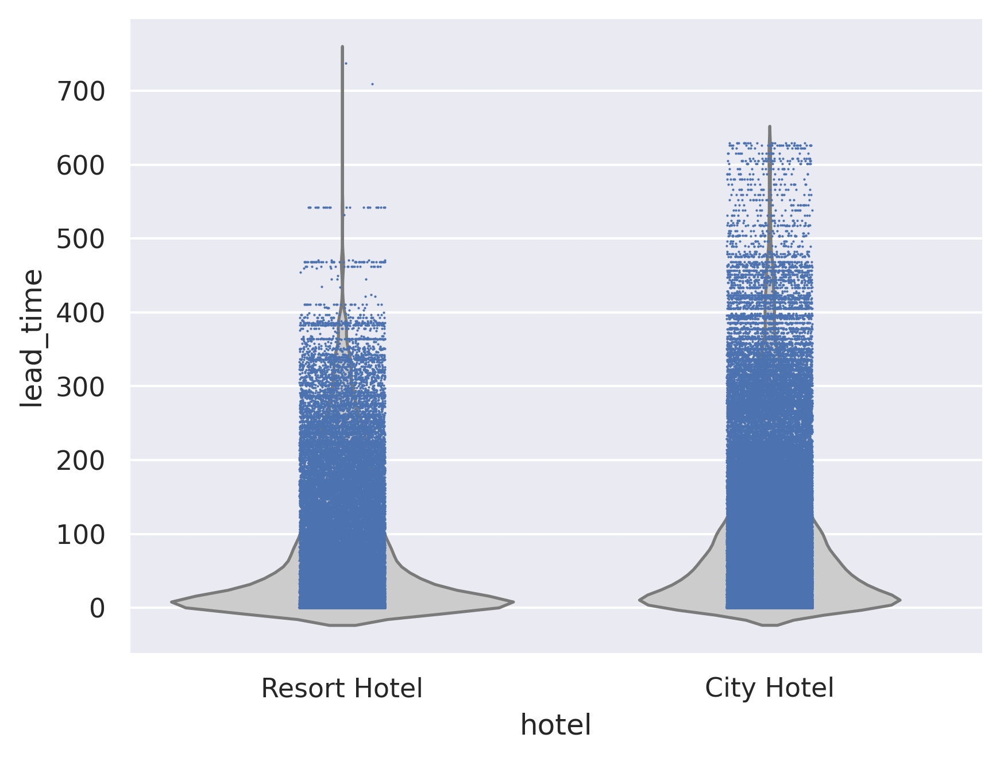
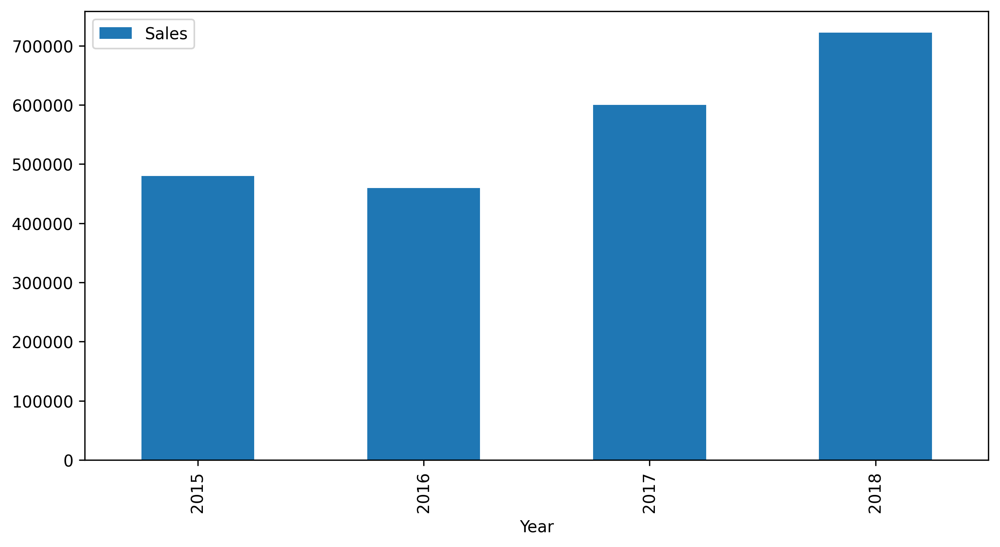
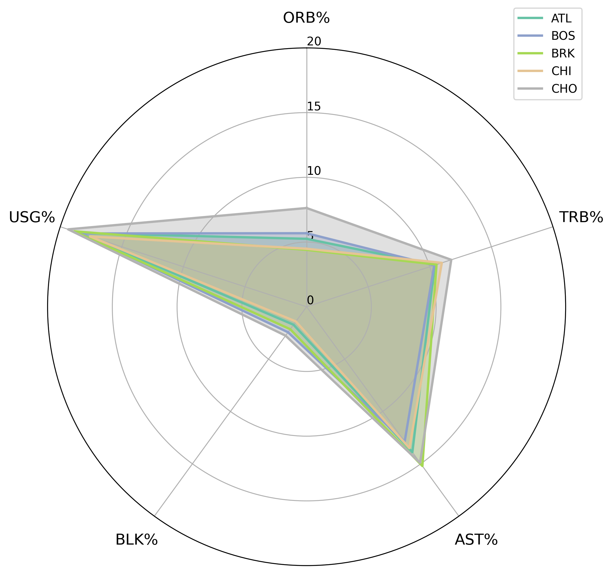
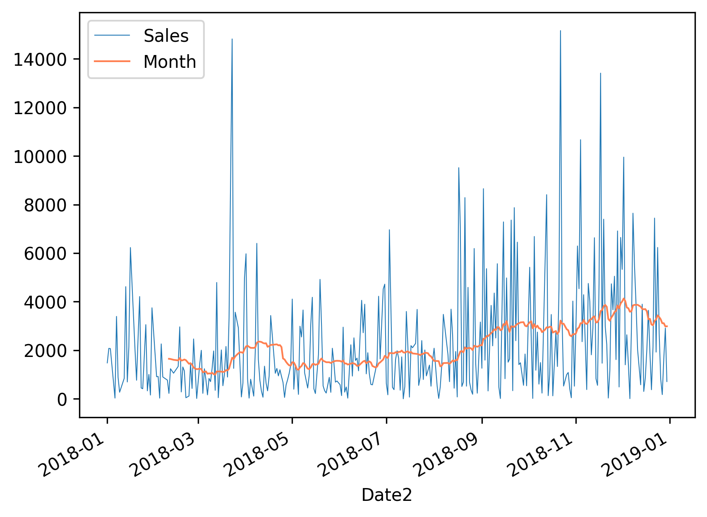

# 통계학 4주차 정규과제

📌통계학 정규과제는 매주 정해진 분량의 『*데이터 분석가가 반드시 알아야 할 모든 것*』 을 읽고 학습하는 것입니다. 이번 주는 아래의 **Statistics_4th_TIL**에 나열된 분량을 읽고 `학습 목표`에 맞게 공부하시면 됩니다.

아래의 문제를 풀어보며 학습 내용을 점검하세요. 문제를 해결하는 과정에서 개념을 스스로 정리하고, 필요한 경우 추가자료와 교재를 다시 참고하여 보완하는 것이 좋습니다.

4주차는 `2부-데이터 분석 준비하기`를 읽고 새롭게 배운 내용을 정리해주시면 됩니다


## Statistics_4th_TIL

### 2부. 데이터 분석 준비하기

### 10. 데이터 탐색과 시각화

<!-- 10. 데이터 탐색과 시각화에서 10.1 탐색적 데이터 분석부터 10.4 비교 시각화 파트까지 진행해주시면 됩니다. -->


**(수행 인증샷은 필수입니다.)** 

<!-- 이번주는 확인 문제가 없고, 교재의 실습에 있는 부분을 따라해주시면 됩니다. 데이터셋과 참고자료는 노션의 정규과제란에 있는 깃허브를 활용해주시면 됩니다. -->


## Study ScheduleStudy Schedule

| 주차  | 공부 범위     | 완료 여부 |
| ----- | ------------- | --------- |
| 1주차 | 1부 p.2~46    | ✅         |
| 2주차 | 1부 p.47~81   | ✅         |
| 3주차 | 2부 p.82~120  | ✅         |
| 4주차 | 2부 p.121~167 | ✅         |
| 5주차 | 2부 p.168~202 | 🍽️         |
| 6주차 | 3부 p.203~250 | 🍽️         |
| 7주차 | 3부 p.251~299 | 🍽️         |

<!-- 여기까진 그대로 둬 주세요-->


---

# 1️⃣ 개념 정리 

## 10. 데이터 탐색과 시각화

```
✅ 학습 목표 :
* EDA의 목적을 설명할 수 있다.
* 주어진 데이터셋에서 이상치, 누락값, 분포 등을 식별하고 EDA 결과를 바탕으로 데이터셋의 특징을 해석할 수 있다.
* 공분산과 상관계수를 활용하여 두 변수 간의 관계를 해석할 수 있다.
* 적절한 시각화 기법을 선택하여 데이터의 특성을 효과적으로 전달할 수 있다.
```

<!-- 새롭게 배운 내용을 자유롭게 정리해주세요.-->

## 데이터 전처리 단계 

: 데이터 분석 프로세스에서 가장 많은 시간과 노력 소모
- ML 모델의 성능↑

## 데이터 시각화

### 📌목적
분석 결과 커뮤니케이션 하기 위함.

## EDA

: 탐색적 데이터 분석(Exploratory Data Analysis)

**기술통계와 데이터 시각화를 통해 데이터의 특성을 파악**

- 데이터의 형태와 척도가 분석에 알맞게 되어있는지 확인

- 데이터의 평균, 분산, 분포, 패턴 등의 확인을 통해 데이터 특성 파악

- 데이터의 결측값이나 이상치 파악 및 보완

- 변수 간의 관계성 파악

- 분석 목적과 방향성 점검 및 보정


왜도 : 데이터 분포의 비대칭 정도
- 0 : 분포가 대칭
- 양수 : 오른쪽 꼬리가 김
- 음수 : 왼쪽 꼬리가 김

< 왼쪽 사진 >

작은 값의 극단치가 평균을 왼쪽으로 끌어내림.

-> But, 데이터의 대부분은 오른쪽에 더 몰림!

< 오른쪽 사진 >

큰 값의 극단치가 평균을 오른쪽으로 끌어올림

-> But, 데이터의 대부분은 왼쪽에 더 몰림!

첨도 : 데이터 분포의 꼭대기 뾰족함(뾰족/완만)
- 0 : 정규분포와 같은 첨도
- 양수 : 뾰족한 분포 (꼭대기 높음) 극단값 ↑ 
    
    ->꼬리부분에 정규분포보다 더 많은 데이터 존재
- 음수 : 납작한 분포 (꼭대기 낮음) 극단값 ↓

### EDA 볼 때 Tip

*엑셀 활용*

데이터 샘플을 1,000개씩(작은 데이터의 예시) 뽑아서 변수와 설명 리스트와 함께 눈으로 보기!

- 이상한 부분이 발견된다면 이를 리스화해서 실무자들과의 미팅을 통해 해결

## 함수

**info()** : 데이터에 대한 전반적인 정보
- 행과 열의 크기
- 칼럼값의 자료형
- 결측값

**describe()** : 기술통계적 측정
- 평균
- 표준편차
- 최댓값
- 최솟값


<br>
<br>

---

# 2️⃣ 확인 과제

> **교재에 있는 실습 파트를 직접 따라 해보세요. 실습을 완료한 뒤, 결과화면(캡처 또는 코드 결과)을 첨부하여 인증해 주세요.단순 이론 암기보다, 직접 손으로 따라해보면서 실습해 보는 것이 가장 확실한 학습 방법입니다.**
>
> > **인증 예시 : 통계 프로그램 결과, 시각화 이미지 캡처 등**

.png)












### 🎉 수고하셨습니다.