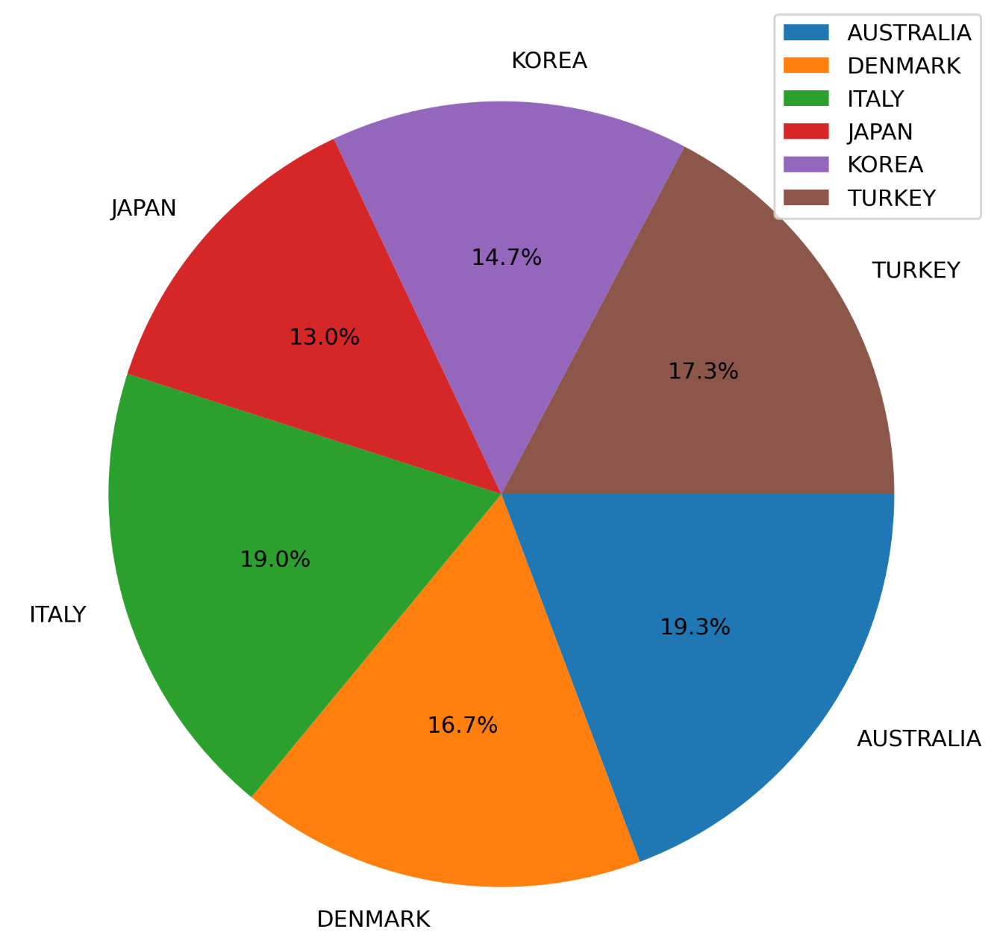
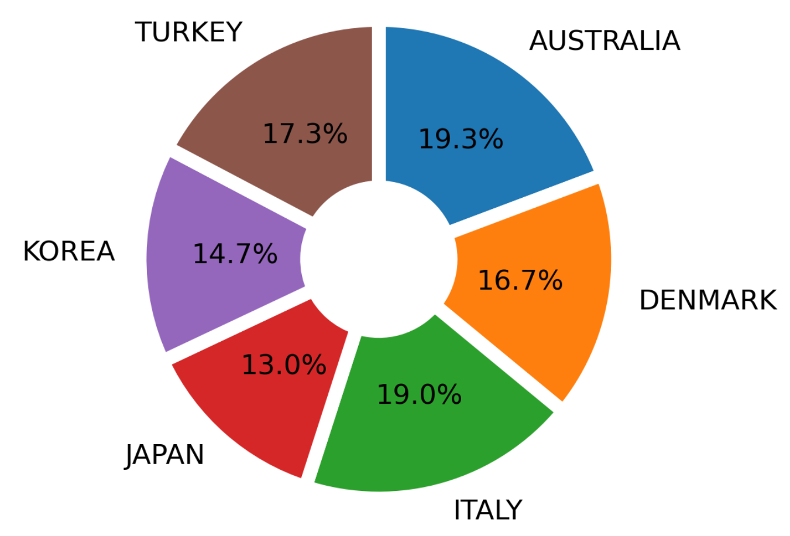
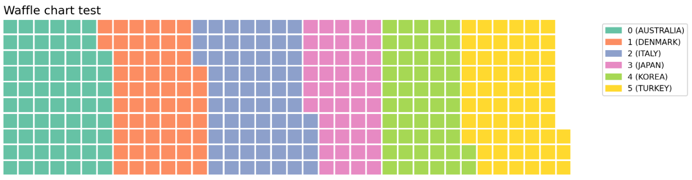
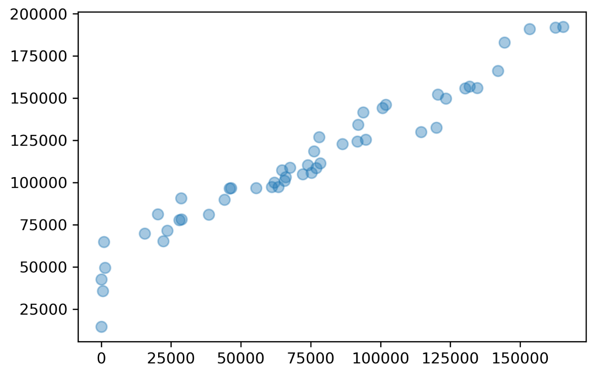
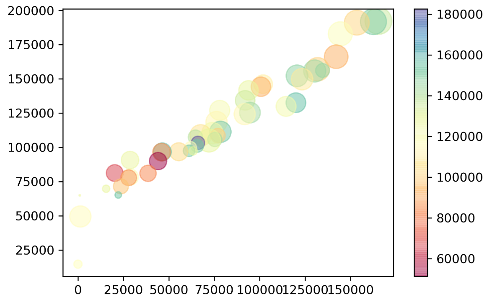
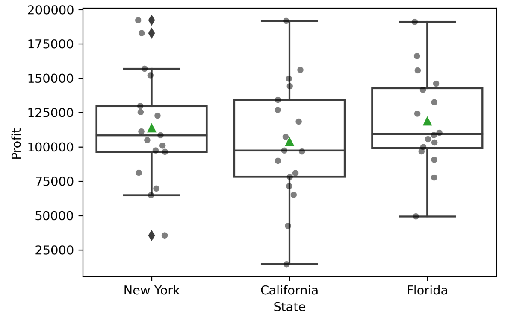

# 통계학 5주차 정규과제

📌통계학 정규과제는 매주 정해진 분량의 『*데이터 분석가가 반드시 알아야 할 모든 것*』 을 읽고 학습하는 것입니다. 이번 주는 아래의 **Statistics_5th_TIL**에 나열된 분량을 읽고 `학습 목표`에 맞게 공부하시면 됩니다.

아래의 문제를 풀어보며 학습 내용을 점검하세요. 문제를 해결하는 과정에서 개념을 스스로 정리하고, 필요한 경우 추가자료와 교재를 다시 참고하여 보완하는 것이 좋습니다.

5주차는 `2부-데이터 분석 준비하기`를 읽고 새롭게 배운 내용을 정리해주시면 됩니다


## Statistics_5th_TIL

### 2부. 데이터 분석 준비하기

### 10. 데이터 탐색과 시각화

- 10.5 분포 시각화부터 10장 마지막 10.8 박스 플롯까지 진행해주시면 됩니다.

**(수행 인증샷은 필수입니다.)** 

<!-- 이번주는 확인 문제가 없고, 교재의 실습에 있는 부분을 따라해주시면 됩니다. 데이터셋과 참고자료는 노션의 정규과제란에 있는 깃허브를 활용해주시면 됩니다. -->

## Study ScheduleStudy Schedule

| 주차  | 공부 범위     | 완료 여부 |
| ----- | ------------- | --------- |
| 1주차 | 1부 p.2~46    | ✅         |
| 2주차 | 1부 p.47~81   | ✅         |
| 3주차 | 2부 p.82~120  | ✅         |
| 4주차 | 2부 p.121~167 | ✅         |
| 5주차 | 2부 p.168~202 | ✅         |
| 6주차 | 3부 p.203~250 | 🍽️         |
| 7주차 | 3부 p.251~299 | 🍽️         |

<!-- 여기까진 그대로 둬 주세요-->

---

# 1️⃣ 개념 정리 

## 10. 데이터 탐색과 시각화

```
✅ 학습 목표 :
* EDA의 목적을 설명할 수 있다.
* 주어진 데이터셋에서 이상치, 누락값, 분포 등을 식별하고 EDA 결과를 바탕으로 데이터셋의 특징을 해석할 수 있다.
* 공분산과 상관계수를 활용하여 두 변수 간의 관계를 해석할 수 있다.
* 적절한 시각화 기법을 선택하여 데이터의 특성을 효과적으로 전달할 수 있다.
```

<!-- 새롭게 배운 내용을 자유롭게 정리해주세요.-->


## **1. EDA(탐색적 데이터 분석)의 목적을 설명할 수 있다.**

EDA는 기술 통계(statistical metrics)와 데이터 시각화(data visualization)를 사용하여 데이터의 특성을 파악하고 분석 방향을 설정하는 기법입니다.

EDA의 **궁극적인 목표**는 데이터 분석 결과를 **효과적으로 해석하고 커뮤니케이션**하기 위함입니다. 데이터 분석 용어 중 **GIGO (Garbage In, Garbage Out)**라는 말이 있듯이, 가치 없는 잘못된 데이터를 사용하면 무의미한 결과가 나오기 때문에, 원천 데이터(raw data)에 포함된 오류나 이상치를 탐색하고 시각화하여 **가치 있는 데이터로 정제**해 나가야 합니다.

EDA의 주요 목적

*   데이터의 형태 및 패턴 확인을 통한 **데이터 건전성(sanity checking) 확인**.
*   데이터의 **결측값(missing value)이나 이상(오류)을 파악하고 보완**하는 작업 수행.
*   변수들 간의 **관계성 파악**.
*   탐색 결과를 바탕으로 **분석 방향을 점검하고 보정**.

## **2. 주어진 데이터셋에서 이상치, 누락값, 분포 등을 식별하고 EDA 결과를 바탕으로 데이터셋의 특징을 해석할 수 있다.**


**A. 분포 시각화 (10.5 Distribution Visualization)**

| 데이터 유형 | 시각화 기법 | 특징 및 해석
| :--- | :--- | :--- 
| **연속형 변수** | **히스토그램(Histogram)** | 데이터를 구간(bin)으로 나누어 해당 구간에 속한 관측치의 비율이나 밀도(density)를 막대그래프로 표현합니다. 데이터의 중심 경향성과 분포 형태를 파악하는 데 유용합니다. | |
| **질적 척도(Categorical)** | **파이 차트/도넛 차트** | 전체 100% 대비 구성 요소의 분포 정도를 면적이나 각도로 표현합니다. 도넛 차트는 가운데 공간을 비워 추가 정보를 삽입할 수 있습니다. | |
| **질적 척도(계층)** | **트리맵(Treemap)** | 구성 요소가 복잡할 때 계층 구조를 직사각형 안에 작은 사각형으로 표현합니다. 한정된 공간 안에서 많은 구성 요소의 분포를 체계적으로 표현할 수 있습니다. | |

**B. 이상치(Outlier) 및 분포 해석 (10.8 Box Plot)**

*   박스 플롯(Box Plot)은 데이터의 **대칭적인 분포 형태를 쉽게 확인**하고, **두 변수의 분포를 비교**할 때 효과적입니다.
    
    박스 플롯은 데이터 속성을 추론할 수 있는 **5가지 대표적인 수치(5-Number Summary)**를 시각적으로 표현합니다
    
    1.  **최솟값:** 1사분위(Q1)에서 1.5 IQR을 뺀 위치 (수염의 끝).
    2.  **1사분위 (Q1):** 25% 위치.
    3.  **2사분위 (Q2):** **중앙값(median)**, 50% 위치 (상자 안의 선).
    4.  **3사분위 (Q3):** 75% 위치.
    5.  **최댓값:** 3사분위(Q3)에서 1.5 IQR을 더한 위치.

*   **이상치 식별:** 최솟값/최댓값의 범위를 넘어가는 값(극단치)은 **작은 원**으로 표시되며, 이는 IQR(Q3 - Q1)의 1.5배를 벗어난 값으로 간주됩니다.

*   **분포 편향성 해석 :** 박스 플롯을 통해 데이터 분포의 편향성을 유추할 수 있습니다. 예를 들어, **중앙값이 상자 아래쪽에 있으면 오른쪽으로 치우친 분포(우측 꼬리 분포)**를 가지고 있음을 유추할 수 있습니다.

**C. 누락값 식별 (EDA 초기 단계)**
*   EDA는 결측값(missing value)을 파악하고 보완하는 것을 목적으로 합니다. (참고: 결측값의 자세한 처리 방법은 11장에서 다뤄집니다.)

## **3. 공분산과 상관계수를 활용하여 두 변수 간의 관계를 해석할 수 있다.** (10.2 공분산과 상관 분석)

두 변수 간의 관계를 수치화하는 데는 공분산과 상관계수가 사용됩니다.

*   **공분산 (Covariance):** 두 변수의 변동이 얼마나 닮았는지를 나타내며, 두 변수의 관계를 파악합니다. 공분산 값이 양수면 양의 상관관계, 음수면 음의 상관관계를 나타냅니다.
    *   **한계:** 공분산은 변수 자체의 척도(단위) 기준이 그대로 반영되므로, 공분산 값의 크기만으로는 상관관계의 강도를 평가하기 어렵습니다.
*   **상관계수 (Correlation coefficient):** 공분산의 단점을 보완하기 위해 공분산을 각 변수의 표준편차 값으로 나누어 **정규화(normalize)**한 값입니다.

*   **피어슨(Pearson) 상관계수:** 가장 널리 사용되며, 값은 항상 **-1과 1 사이($-1 \le R \le 1$)**에 존재합니다.
    *   **강도 해석:** 절댓값이 **0.7 이상**이면 매우 강한 상관관계, **0.4 이상**이면 어느 정도 상관관계가 있다고 해석합니다.

*   **관계 해석 시 유의점:** 상관계수는 두 변수 간의 **선형 관계의 정도**만을 측정합니다. 따라서 상관계수가 0이더라도 두 변수 사이에 2차 방정식 형태와 같은 다른 통계적 패턴이 숨겨져 있을 수 있으므로, 관계를 평가할 때는 상관계수뿐만 아니라 **산점도**와 같은 시각화 기법을 함께 사용해야 합니다.
*   **시각화 활용:** 변수들 간의 상관관계 전체를 파악할 때는 상관계수 행렬을 **히트맵(Heatmap)** 형태로 시각화하여 색상의 농도나 채도를 통해 강도와 방향을 직관적으로 확인할 수 있습니다. 특히 `cluster map` 히트맵은 변수들 간의 유사도를 바탕으로 변수를 묶어주어 가독성을 높여줍니다.

## **4. 적절한 시각화 기법을 선택하여 데이터의 특성을 효과적으로 전달할 수 있다.**

데이터의 목적과 특성(분포, 관계, 공간)에 따라 선택해야 하는 시각화 기법은 다음과 같습니다.

**A. 관계 시각화 (10.6 Relationship Visualization)**
*   **산점도 (Scatter Plot):** 두 개의 **연속형 변수** 간의 분포와 추세를 나타냅니다. 산점도를 그릴 때는 **극단치(이상치)를 제거**해야 분포 구간이 압축되어 시각화의 효율이 떨어지는 것을 방지할 수 있습니다.
*   **버블 차트 (Bubble Chart):** 산점도의 기본 형태에 **버블의 크기, 색상** 등의 요소를 추가하여 **세 가지 이상 변수의 관계**를 표현할 수 있습니다. 다만, 버블의 크기를 해석할 때는 **원의 지름이 아닌 면적**을 통해 크기를 파악하도록 주의해야 합니다.

**B. 공간 시각화 (10.7 Spatial Visualization)**
지리적 위치와 관련된 데이터를 실제 지도 위에 표현하는 것이 효과적이며, 데이터를 미시적(개별 점) 또는 거시적(지역 구분)으로 분석하는 데 사용됩니다.

| 기법 | 표현 방식 | 특징 및 용도 
| :--- | :--- | :--- 
| **도트맵 (Dot Map)** | 지리적 위치에 작은 점을 찍어 데이터 분포 표현. | 데이터의 개략적인 분포를 파악하며, 정확한 값을 전달하기 어렵다. | |
| **버블맵 (Bubble Map)** | 버블 크기로 데이터 값의 크기를 표현. | 코로플레스맵보다 비율 비교에 효과적이지만, 큰 버블이 겹칠 수 있다. | |
| **코로플레스맵 (Choropleth Map)** | 지역 구분(경계선)을 사용하여 데이터 크기를 색상의 음영이나 채도로 표현. | 데이터 크기에 따라 색상의 명도를 다르게 표현하며, 작은 지역에 비해 큰 지역이 강조될 수 있다. | |
| **커넥션맵 (Connection Map)** | 지리적 지점들을 선이나 곡선으로 연결하여 관계나 경로를 표현. | 연속적인 연결이나 집중 분포를 파악하는 데 사용된다. | |

**C. 요약 시각화 (10.8 Summary Visualization)**
*   **박스 플롯:** 위에 설명된 대로, 데이터의 분포와 이상치를 **5가지 수치**로 압축하여 표현함으로써 데이터의 특성을 빠르게 요약하고 그룹 간의 분포를 비교하는 데 가장 효과적인 기법입니다.

<br>
<br>

---

# 2️⃣ 확인 과제

> **교재에 있는 실습 파트를 직접 따라 해보세요. 실습을 완료한 뒤, 결과화면(캡처 또는 코드 결과)을 첨부하여 인증해 주세요.단순 이론 암기보다, 직접 손으로 따라해보면서 실습해 보는 것이 가장 확실한 학습 방법입니다.**
>
> > **인증 예시 : 통계 프로그램 결과, 시각화 이미지 캡처 등**

<!-- 이 주석을 지우고 “실습 결과 화면(캡처)을 이곳에 첨부해주세요.-->

### 히스토그램


### 파이차트


### 도넛차트


### 와플차트


### 산점도


### 버블차트


### 박스플롯



### 🎉 수고하셨습니다.