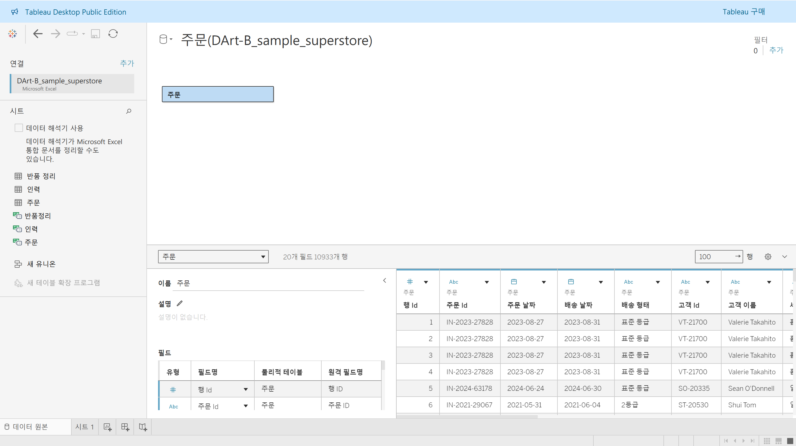
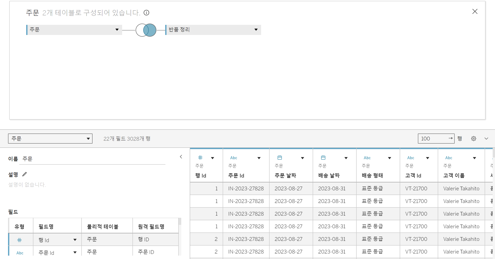
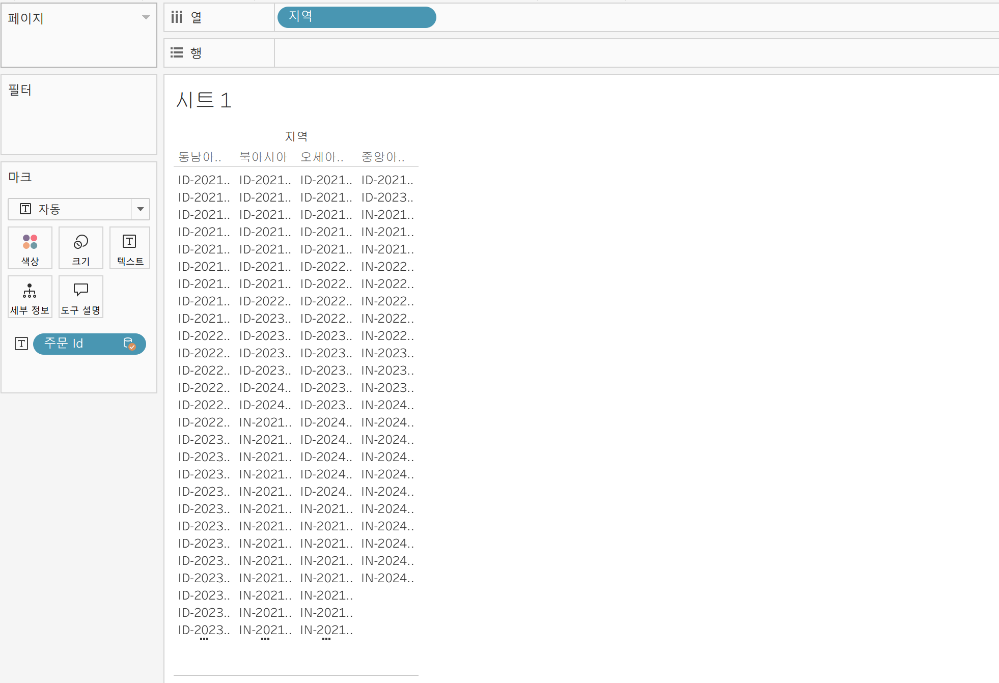

# Tableau 1주차 정규과제
 
📌Tableau 정규과제는 매주 정해진 **유튜브 강의를 통해 태블로 이론 및 기능을 학습한 후, 실습 문제를 풀어보며 이해도를 높이는 학습 방식**입니다. 

이번주는 아래의 **Tableau_1st_TIL**에 명시된 유튜브 강의를 먼저 수강해주세요. 학습 중에는 주요 개념을 스스로 정리하고, 이해가 어려운 부분은 강의 자료나 추가 자료를 참고해 보완하세요. 과제 작성이 끝난 이후에는 **Github에 TIL과 실습 인증 결과를 업로드 후, 과제 시트에 제출해주세요.**


**(수행 인증샷은 필수입니다.)** 

> 태블로를 활용하는 과제인 경우, 따로 캡쳐도구를 사용하여 이미지를 첨가해주세요.


## Tableau_1st_TIL

### 01. 태블로 설치

### 02. 태블로 연결

### 03. 데이터 연결과 데이터 유형

### 04. 데이터 결합과 관계

### 05. 데이터 결합과 조인

### 06. 데이터 결합과 혼합

### 07. 데이터 결합과 유니온

### 08. 라이브와 추출

### 09. 데이터 형식


<br>

## 주차별 학습 (Study Schedule)

| 주차  | 공부 범위          | 완료 여부 |
| ----- | ------------------ | --------- |
| 1주차 | **강의 1 ~ 9강**   | ✅         |
| 2주차 | **강의 10 ~ 19강** | 🍽️         |
| 3주차 | **강의 20 ~ 29강** | 🍽️         |
| 4주차 | **강의 30 ~ 39강** | 🍽️         |
| 5주차 | **강의 40 ~ 49강** | 🍽️         |
| 6주차 | **강의 50 ~ 59강** | 🍽️         |
| 7주차 | **강의 60 ~ 69강** | 🍽️         |

<!-- 여기까진 그대로 둬 주세요-->


---

# 1️⃣ 학습 내용 정리

## 1강. 태블로설치


<!-- 태블로 Desktop은 유료 혹은 사용자 인증이 되어야 하므로, 사용 경험이 없으시다면 우선 Tableau Public으로 학습하는 것을 권장드립니다. -->


## 2강. 태블로연결


> **🧞‍♀️ 데이터 해석기는 어떤 경우 사용하나요?**

```
데이터 해석기를 지원하는 커넥터에서 병합된 셀, 메모, 바닥글, 빈 셀 등을 감지하고 이를 무시하여 데이터 집합의 실제 필드와 값을 식별할 수 있게 하는 기능

데이터 관리 시 Tableau가 읽기 쉽도록 해야하나 그렇지 않은 경우 데이터 해석기 기능 활용!
```


> **🧞‍♀️ 깃허브 assignment 폴더의 DArt-B Sample Store.xls 파일을 다운받고 시트 중 '주문' 시트를 불러와주세요.**




## 3강. 데이터연결과 데이터 유형


> **🧞‍♀️ 라이브와 추출의 차이가 무엇인가요? 어떤 경우 사용하나요?**


```
## 라이브

Tableau → 데이터 직접 연결하는 형태

- 데이터 원본에 변화가 생기면 시트에서 작업한 내용에 바로 영향
- 단점 : 데이터 양이 많아지면 처리 속도 및 성능 저하

## 추출

hyper : Tableau의 새로운 인메모리 데이터 엔진 기술

- 크거나 복잡한 데이터 집합에 대한 빠른 데이터 수집 및 분석 쿼리 처리를 위해 설계된 형태
- 오프라인 상태에서도 작업 가능
- 라이브에 비해서 처리 속도가 빠르다는 특징
```


## 4강. 데이터결합과 관계


> **🧞‍♀️ 어떤 경우에 관계를, 어떤 경우에 조인을 사용하나요?**

```
태블로는 관계와 조인이라는 두 가지 방법으로 데이터를 결합할 수 있습니다. 

[ 관계 ]

- 조인으로 결합된 데이터보다 동적이고 유연하게 연결된다는 점에서 차이
→ 원본 데이터를 조금 더 독립적으로 활용 가능
- 결합하려는 데이터 간의 유형이 동일해야 가능

권장 : 데이터를 결합할 때 원래 테이블의 세부 수준을 유지할 수 있게 하기 때문에 관계로 결합하기

* 데이터의 루트 테이블을 삭제하게 되면 관련된 하위 테이블이 모두 삭제되기 때문에 테이블 모델링의 순서에 유의해야 합니다. 
```


## 5강. 데이터결합과 조인

<!-- 데이터 결합과 조인에 대해 알게 된 점을 적고, 아래 질문에 답해보세요 :) -->

주문 중 '반품된' 주문만을 가지고 분석을 진행하려고 합니다.

> **🧞‍♀️ 해당 목적 달성을 위해서 Sample store 데이터셋의 어떤 시트를 조인(혹은 릴레이션)해야 할까요? 조인키는 무엇인지, (inner, outer, left, right) 조인 유형은 무엇일지 논의해주세요.**

데이터를 조인한 데이터 원본 창의 캡쳐를 첨부해주세요.
몇 개의 주문이 반품되었다고 표시되나요?
```
제어 혹은 의도적인 filtering 복제를 위해 join으로 데이터를 결합하는 경우가 있음

inner :  데이터를 결합할 경우 두 테이블 모두에 일치하는 항목만을 포함
outer : 두 테이블에 모든 값을 완전히 포함하는 테이블 생성
left & right : 한쪽 테이블의 모든 값과 반대쪽 테이블에 해당하는 일치 항목만을 포함
```
```
right join
```



## 6강. 데이터결합 혼합

<!-- 데이터결합 및 혼합에 대해 알게 된 점을 적어주세요 -->
```
혼합의 경우 관계나 조인과 달리 데이터를 실제로 결합하지는 않습니다. 

- 혼합 : 각 데이터의 원본을 독립적으로 결과를 집계한 후 한 시트에서 데이터를 시각화할 수 있도록 하는 방법
즉, 실제 혼합된 데이터 원본은 없고 여러 데이터 원본의 혼합된 결과만을 화면에 나타내는 것

현재 태블로에서는 데이터 결합 방법으로 혼합을 추천 X
→ 관계로 데이터 원본을 결합할 수 있기 때문에 기술적 제한이 있는 경우에만 혼합 방법 사용하기
```


## 7강. 데이터 결합과 유니온

<!-- 유니온에 대해 알게 된 점을 적어주세요 -->

> **🧞‍♀️ 유니온을 사용하기 위한 전제 조건은 무엇인가요?**

```
유니온은 한 테이블의 행을 다른 테이블에 추가하여 데이터를 결합하는 방법입니다. 

데이터를 유니온으로 결합하기 위해서는 데이터의 테이블 구조가 동일해야 합니다. 각 테이블의 필드 수가 같고, 관련 관련 필드에 필드 이름과 데이터 유형이 일치해야 합니다. 
```

- 방법1 : 새 유니온 더블 클릭
- 방법2 : 테이블 하나를 시트로 끌어온 다음 유니온하고자 하는 테이블을 시트 테이블 바로 밑으로 드래그
- 방법3 : 와일드카드 사용

## 8강. 라이브와 추출

<!-- 라이브와 추출에 대해 알게 된 점을 적어주세요 -->

> **🧞‍♀️ 라이브와 추출 방법의 차이가 무엇인가요? 어떤 경우에 추출을 사용하면 좋을까요?**

`라이브 vs 추출 차이점`

: 데이터를 가져오는 방식의 차이예요.

## 라이브 
- 방식 : 데이터 원본(서버/DB)에 선을 연결해두고 실시간으로 데이터를 보여줍니다.

- 장점 : 원본 데이터가 바뀌면 태블로 화면에서도 실시간으로 바로 반영됩니다. (새로고침 누를 필요 없음!)

- 단점 : 인터넷이 느리면 버퍼링 걸리듯, 데이터 양이 많거나 서버가 느리면 화면 뜨는 속도도 느려집니다.

## 추출
- 방식 : 현재 시점의 데이터를 사진 찍듯이 찍어서(스냅샷) 내 컴퓨터(메모리)에 따로 저장해두고 사용

- 장점 : 이미 컴퓨터에 가져다 놨기 때문에 원본 서버 상태랑 상관없이 속도가 빠름

- 단점 : 다운로드한 시점의 데이터이므로 원본 데이터가 바뀌어도 자동으로 안 바뀝니다. (최신 데이터를 보려면 '새로 고침' 해주기)

> ### 그럼 언제 추출을 써야 할까요?

1. 데이터가 너무 클 때 (속도가 중요할 때) 

2. 데이터가 매일매일 바뀔 필요가 없을 때 

3. 오프라인에서 작업할 때 

--- 
**참고자료 : 온프레미스 데이터란?**

기업이나 조직이 자체적으로 보유한 물리적 서버나 데이터 센터 내에서 직접 관리하는 데이터로, 조직 내의 하나 이상 서버에서 통제됩니다. 본 서버들은 기업의 데이터센터나 물리적 위치에 설치되어 있으며, 네트워크를 통해 해당 데이터에 접근하고 관리할 수 있습니다.


## 9강. 데이터형식

<!-- 데이터형식에 대해 알게 된 점을 적어주세요 -->


<br>
<br>


# 2️⃣ 확인 문제

## 문제 1.

> **🧚푸앙이는 아래 사진과 같이 2024년 3월부터 7월까지의 지하철 승하차 이용객 데이터를 가지고 있습니다. 월별로 데이터셋이 나누어진 상태며, 푸앙이는 해당 데이터셋 5개 모두를 한 번에 시각화하려 합니다. 필드 값(컬럼)의 이름, 데이터 유형, 개수는 모두 같습니다.**


> **이때, '조인, 관계, 혼합, 유니온' 중 본 목적에 적합한 결합 방법은 무엇인가요? 하나씩 드래그하지 않고, 와일드카드를 이용해 모든 데이터를 빠르게 결합해보세요.**


~~~
텍스트 및 이미지로 문제 풀이 과정을 기술해주세요. 
~~~


## 문제 2.

> **🧚푸앙이는 태블로를 사용하여 회사의 매출 데이터를 시각화하려고 합니다. 태블로에서는 데이터를 연결하는 두 가지 방식인 라이브 연결과 추출 연결이 있습니다. 두 방식 중 어떤 것을 사용할지 고민 중입니다. 다음의 일상생활 사례를 바탕으로, 어떤 상황에서 라이브 연결이 적합하고, 어떤 상황에서 추출 연결이 더 적합한지 설명하세요.**

1. 사례 1: 실시간 주식 시세 확인
주식 거래를 하고 있는 수금의왕 푸앙이는 주식 시세가 매 순간 변동하는 실시간 데이터를 필요로 합니다. 이 데이터를 기반으로 빠르게 결정을 내려야 합니다.


```
여기에 답을 적어주세요!
```


2. 사례 2: 푸앙이는 저번 주 제주도로 여행을 갔었어요. 비행 중에 예산 계획을 세우려 하는데, 인터넷 연결이 불안정할 것 같아요. 여행 전 미리 예산 데이터를 다운로드해서 오프라인에서도 사용할 수 있으면 좋겠습니다.


```
여기에 답을 적어주세요!
```


## 참고 자료

>  **데이터 분석을 하다보면 지역별로 경향을 알아보고자 할 때가 많습니다. 태블로에서는 시/도, 시군구명을 칼럼으로 가지고 있고, 그걸 지리적 위치로 바꿔주면 지도에서 위치를 인식하는데요. 하지만 읍면동(행정동) 단위까지 인식하지는 못합니다. 그럼 어떻게 읍면동 단위까지 세분화하여 표기할 수 있을까요? 이때 방금 배운 데이터 릴레이션 혹은 조인을 사용합니다. 맵 그래프는 지금 배울 부분은 아니지만, 데이터 병합에 관련된 부분이기에 필요하신 분들을 위해 아래 링크를 걸어두겠습니다.**


바로 읍면동의 경계를 가지고 있는 shp, geojson 등 공간파일을 원본데이터와 머지하는 것입니다.

링크: https://subinze.tistory.com/m/2

<br>

<br>

### 🎉 수고하셨습니다.
