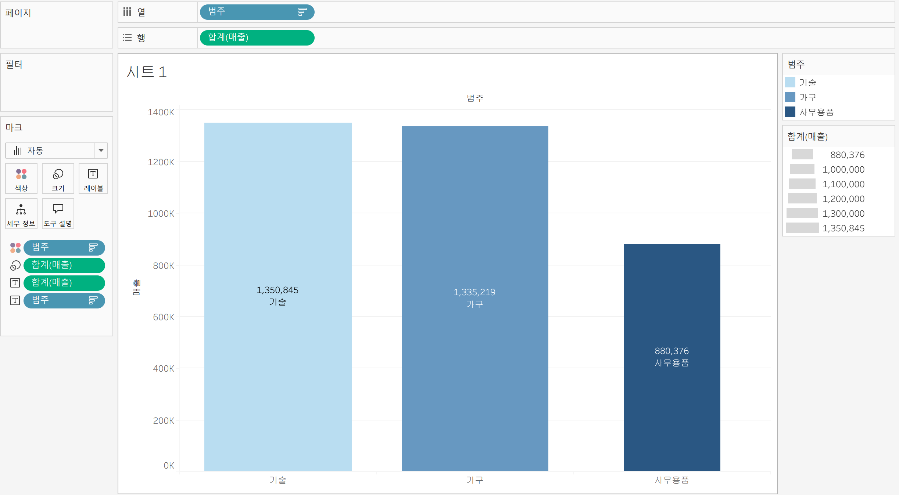

# Tableau 2주차 정규과제

📌Tableau 정규과제는 매주 정해진 **유튜브 강의를 통해 태블로 이론 및 기능을 학습한 후, 실습 문제를 풀어보며 이해도를 높이는 학습 방식**입니다. 

이번주는 아래의 **Tableau_2nd_TIL**에 명시된 유튜브 강의를 먼저 수강해주세요. 학습 중에는 주요 개념을 스스로 정리하고, 이해가 어려운 부분은 강의 자료나 추가 자료를 참고해 보완하세요. 과제 작성이 끝난 이후에는 **Github에 TIL과 실습 인증 결과를 업로드 후, 과제 시트에 제출해주세요.**


**(수행 인증샷은 필수입니다.)** 

> 태블로를 활용하는 과제인 경우, 따로 캡쳐도구를 사용하여 이미지를 첨가해주세요.


## Tableau_2nd_TIL

### 10. 차원과 측정값

### 11. 시각화

### 12. 막대 그래프

### 13. 누적막대 그래프

### 14. 병렬막대 그래프

### 15. 누적병렬막대 그래프

### 16. 라인 그래프

### 17. 맵 작성

### 18. 텍스트 레이블

### 19. 트리맵과 하이라이트 테이블


<br>

## 주차별 학습 (Study Schedule)

| 주차  | 공부 범위          | 완료 여부 |
| ----- | ------------------ | --------- |
| 1주차 | **강의 1 ~ 9강**   | ✅         |
| 2주차 | **강의 10 ~ 19강** | ✅         |
| 3주차 | **강의 20 ~ 29강** | 🍽️         |
| 4주차 | **강의 30 ~ 39강** | 🍽️         |
| 5주차 | **강의 40 ~ 49강** | 🍽️         |
| 6주차 | **강의 50 ~ 59강** | 🍽️         |
| 7주차 | **강의 60 ~ 69강** | 🍽️         |

<!-- 여기까진 그대로 둬 주세요-->


---

# 1️⃣ 학습 내용 정리

## 10강: 차원과 측정값

<!-- 차원과 측정값에 관해 배우게 된 점을 적어주세요 -->

> **🧞‍♀️ 차원과 측정값의 고유한 특성에 대해 설명해주세요.**

태블로에서 차원과 측정값은 데이터 분석과 시각화의 기본적인 개념입니다. 각각의 고유한 특성은 다음과 같습니다.

### 차원의 특성
- **정성적(질적) 데이터**: 이름, 카테고리 등 집계나 계산이 아닌 독립적인 값을 가집니다.
- **집계되지 않음**: 합계, 평균 등 수치적 집계가 불가능합니다.
- **데이터의 분류 기준**: 데이터를 그룹화하거나 분류하는 데 사용됩니다.
- **불연속형이 기본**: 개별적으로 구분되는 값(예: 제품명, 지역 등)으로 주로 불연속형 필드입니다.

### 측정값의 특성
- **정량적(수치) 데이터**: 매출, 수익, 수량 등 수치로 표현되는 데이터입니다.
- **집계 가능**: 합계, 평균, 최대/최소 등 다양한 방식으로 집계할 수 있습니다.
- **분석의 대상**: 차원에 의해 그룹화되어 분석되는 값입니다.
- **연속형이 기본**: 단절이 없는 연속적인 값(예: 10만원~50만원의 매출 등)으로 주로 연속형 필드입니다.

> 예시로, 제품명은 차원이면서 불연속형 필드이고, 매출은 측정값이면서 연속형 필드입니다. 

또한, 차원과 측정값, 연속형과 불연속형은 서로 다른 개념이므로 통합해서 생각하면 안 됩니다.

*Quiz: 차원은 불연속형이고, 측정값은 연속형이다 (o, x)*

-> 정답 X
> 차원은 주로 불연속형 필드로 사용되지만, 연속형 차원도 존재할 수 있습니다. 예를 들어, 날짜 필드는 차원이면서 연속형으로도 사용할 수 있습니다.
측정값은 주로 연속형 필드로 사용되지만, 불연속형 측정값도 만들 수 있습니다.


## 11강: 시각화

<!-- 시각화 관해 배우게 된 점을 적어주세요 -->

*Quiz: 차원은 대부분 불연속형이며 표 형태로 시각화했을 때 머리글로 표시되고, 측정값은 대부분 연속형이므로 표 형태로 시각화 진행했을 때 패널로 추가된다.(o, x)*

-> 정답 O

> 차원은 대부분 불연속형이며 표 형태로 시각화를 진행했을 때 머리글로 표시가 됨. 

> 측정값은 대부분 연속형이고 표 형태로 시각화를 진행했을 때 패널로 표시가 됨.

## 12강: 막대그래프

<!-- 막대그래프에 관해 배우게 된 점을 적어주세요 -->


- 막대그래프는 여러 범주의 데이터를 비교할 때 매우 유용한 기본 시각화 방법입니다.

- 태블로에서 막대그래프를 만들려면, 예를 들어 '제품 카테고리' 필드를 열 선반에, '매출' 필드를 행 선반에 드래그하면 카테고리별 매출을 막대그래프로 볼 수 있습니다. 

- 막대그래프의 정렬은 빠른 메뉴의 내림차순 정렬 버튼을 사용하거나, 제품 카테고리 필드에서 마우스 오른쪽 클릭 후 정렬 옵션을 통해 매출 기준 내림차순 등으로 직접 설정할 수 있습니다. 

- 세로 막대그래프와 가로 막대그래프는 행과 열 선반의 필드 위치를 바꾸거나, 빠른 메뉴의 행렬 바꾸기 기능을 통해 쉽게 전환할 수 있습니다. 

- 카테고리별로 색상을 다르게 하여 시각적으로 더 효과적인 그래프를 만들 수 있으며, 색상 범례의 정렬도 매출 기준으로 맞출 수 있습니다. 

- 막대그래프에 매출 숫자나 카테고리명을 레이블로 표시할 수 있고, 레이블의 위치도 조정할 수 있습니다. 

- 막대의 두께를 매출 크기에 따라 조정할 수도 있습니다.


## 13강: 누적막대그래프

<!-- 누적막대그래프에 관해 배우게 된 점을 적어주세요 -->

<!-- 테이블(아래로)와 테이블(옆으로)의 계산 방식을 습득해보세요. 이에 관련해 아래 참고자료도 있습니다 :) -->


- 누적 막대그래프는 차원별로 측정값의 비중을 시각적으로 보여주기 위해 사용됩니다. 축을 활용하여 구성비의 변화를 한눈에 파악할 수 있습니다.
- 태블로에서 누적 막대그래프를 만들기 위해서는, 예를 들어 카테고리별 매출을 기준으로 연도별 누적 값을 시각화할 수 있습니다. 
- 연도별 매출을 색상으로 구분하여 시각적으로 구분할 수 있으며, 레이블을 활용해 매출과 연도 정보를 그래프에 표시할 수 있습니다. 
- 매출의 백분율(구성비)을 표시하려면, 행 선반의 매출 필드에서 '퀵 테이블 계산'의 '구성 비율'을 선택하면 됩니다. 
- 계산 기준을 변경하여 카테고리별 연도 매출 비율 등 다양한 방식으로 백분율을 표현할 수 있습니다.

> 테이블(아래로): 이 방식은 같은 열(세로 방향) 내에서 위에서 아래로 누적하거나 계산합니다. 

예를 들어, 카테고리별 연도 매출 비율을 보고 싶을 때 사용합니다. 매출 필드에서 마우스 오른쪽 클릭(또는 역삼각형 클릭) 후 '다음을 사용하여 계산'에서 '테이블 아래로'를 선택하면, 각 카테고리 내에서 연도별 매출 비율이 계산됩니다. 

> 테이블(옆으로): 이 방식은 같은 행(가로 방향) 내에서 왼쪽에서 오른쪽으로 누적하거나 계산합니다.

 예를 들어, 연도별로 카테고리의 매출 비율을 보고 싶을 때 사용합니다. 이 경우에도 '다음을 사용하여 계산'에서 '테이블 옆으로'를 선택하면, 각 연도 내에서 카테고리별 매출 비율이 계산됩니다.

## 14강: 병렬막대그래프

<!-- 병렬막대그래프에 관해 배우게 된 점을 적어주세요 -->


> *🧞‍♀️ 끊어진 색상으로 배치되어 표현되는 경우와 이어지는 그라데이션 색으로 표현되는 경우 두 가지가 있습니다. 위 사진의 경우 왜 색깔이 끊어지는 색상으로 표시되지 않고 그라데이션으로 표시되었나요? 데이터의 특성과 관련하여 이야기해 봅시다.*

태블로에서 색상이 끊어진 색상(불연속형)으로 표시되는 경우와 이어지는 그라데이션(연속형)으로 표시되는 경우의 차이는 데이터 필드의 유형, 즉 불연속형과 연속형에 따라 결정

- **불연속형 필드**: 값이 명확하게 구분되는 범주형 데이터입니다. 예를 들어, 연도, 월, 카테고리 등은 각각의 값이 독립적으로 구분됩니다. 이 경우 색상도 각각의 값마다 끊어진 색상(개별 색상)으로 표시됩니다.

.jpg>)
.jpg>)

- **연속형 필드**: 값이 연속적으로 이어지는 수치형 데이터입니다. 예를 들어, 매출액, 날짜(연속형), 점수 등은 값이 연속적으로 변화합니다. 이 경우 색상도 값의 크기에 따라 이어지는 그라데이션으로 표시됩니다.

따라서, 위 사진에서 색상이 그라데이션으로 표시된 이유는 색상을 지정한 필드가 연속형으로 설정되어 있기 때문입니다. 연속형 필드는 값의 크기에 따라 색상이 자연스럽게 이어지도록 표현됩니다. 만약 색상을 끊어진 색상으로 표현하고 싶다면, 해당 필드를 불연속형으로 변경해야 합니다.

## 15강: 누적병렬막대그래프

<!-- 누적병렬막대그래프에 관해 배우게 된 점을 적어주세요 -->


> *🧞‍♀️ 위 사진에서는 Profit과 Sales를 측정값으로 두었습니다.  개별 칼럼(태블로에서는 #필드라 명칭합니다)을 열/행에 두는 대신, '측정값'을 사용하고 측정값 선반에 필드를 올려둡니다. 이런 방식을 사용하는 이유가 무엇일지, 어떻게 사용할 수 있을지 고민해보세요*

태블로에서 '측정값'을 사용하여 여러 개별 필드를 측정값 선반에 올리는 방식은 다음과 같은 이유와 장점이 있습니다.

## 1. 여러 측정값을 한 번에 시각화
- Profit(수익)과 Sales(매출)처럼 여러 개의 수치 데이터를 한 그래프에 동시에 표현할 수 있습니다.
- 각각을 별도의 행/열에 두면 시각화가 분리되지만, 측정값 선반을 활용하면 한 차트 내에서 비교가 용이합니다.

## 2. 동적 비교와 누적/병렬 그래프 구현
- 측정값 선반에 여러 필드를 올리면, 태블로는 자동으로 병렬 막대그래프, 누적 막대그래프 등 다양한 형태로 시각화할 수 있습니다.
- 예를 들어, 지역별로 Profit과 Sales를 나란히 혹은 누적해서 보여줄 수 있습니다. 

## 3. 필드 관리의 효율성
- 측정값 선반을 사용하면 여러 필드를 한 번에 관리할 수 있어, 필드별로 반복 작업을 줄일 수 있습니다.
- 측정값 이름/측정값 값 필드를 활용해 동적으로 필터링, 색상 구분 등 다양한 분석이 가능합니다.

## 4. 사용 방법
- 측정값 선반에 원하는 수치 필드를 드래그 앤 드롭합니다.
- 행/열 선반에 측정값을 올리면, 태블로가 자동으로 측정값 이름/값을 생성해줍니다.
- 마크 카드에서 색상, 크기, 레이블 등 추가 설정을 통해 시각화를 세밀하게 조정할 수 있습니다.

이 방식은 여러 수치 데이터를 한눈에 비교하거나, 누적/병렬 그래프 등 복합적인 시각화가 필요할 때 매우 유용합니다.

<!-- 정답은 없습니다 -->


## 16강: 라인그래프

<!-- 라인그래프에 관해 배우게 된 점을 적어주세요 -->

- 라인 그래프는 데이터의 시간별 추세를 확인하거나 미래 값을 예측할 때 많이 사용됩니다.
- 태블로에서 열에 날짜 필드를 넣으면 자동으로 라인 그래프가 생성됩니다. 
- 월별로 데이터를 보고 싶을 때는 주문 일자 필드에서 월까지 확장하고, 불연속형 대신 연속형 월로 바꿔야 라인이 끊기지 않고 연결됩니다. 
- 매출과 수익 등 두 가지 값을 비교할 때는 이중축을 활용할 수 있습니다. 이때 양쪽 세로축의 값이 달라 왜곡될 수 있으므로, 필요에 따라 축 동기화를 할 수 있습니다. 
- 그래프의 색상이나 표현 형식은 마크창에서 자유롭게 변경할 수 있습니다. 

## 17강: 맵작성

<!-- 맵차트 관해 배우게 된 점을 적어주세요 -->

```js
## 참고
Country/Region - 나라/지역
State/Province - 시/도
City - 시
County - 군
Postal Code - 우편번호
Area Code - 지역 코드
Airport - 공항
MSA/CBSA (Metropolitan Statistical Area) - 광역 통계 지역
Longitude - 경도
Latitude - 위도
```

태블로에서 맵 차트를 만드는 방법과 관련하여 다음과 같은 점을 배웠습니다:

- 태블로는 지리적 역할(예: 주, 시도, 도시 등)이 부여된 데이터를 활용해 쉽게 맵 차트를 만들 수 있습니다.
- 데이터 필드에 지리적 역할이 부여되어 있으면, 위도와 경도 값이 자동으로 생성되어 맵에 위치가 표시됩니다. 
- 맵의 위치가 잘못 표시될 경우, 상단 메뉴의 '맵 > 위치 편집'에서 국가나 지역을 올바르게 설정해야 합니다. 
- 매출, 수익 등 다양한 데이터를 색상이나 크기로 시각화할 수 있습니다. 예를 들어, 매출은 색상, 수익은 크기로 표현할 수 있습니다. 
- 이중축을 활용하면 한 맵에서 두 가지 데이터를 동시에 시각화할 수 있습니다. 
- 마크 계층(레이어)을 활용하면 주와 도시 등 여러 지리적 계층을 한 맵에 동시에 표현할 수 있습니다. 
- 위치가 올바르게 표시되지 않을 때는 위치 필드를 다시 설정해야 합니다. 


## 18강: 텍스트테이블

<!-- 텍스트테이블에 관해 배우게 된 점을 적어주세요-->

- 텍스트 테이블은 일반적으로 보는 표 형식으로, 태블로에서는 행과 열 선반에 차원을 배치하여 생성합니다.
- 예시로 연도별 제품 하위 범주 매출을 텍스트 테이블로 확인할 수 있습니다. 
- 날짜 필드를 열에, 매출을 마크 창의 텍스트에, 제품 하위 범주를 행 선반에 드래그하면 크로스탭이 완성됩니다.
- 범주 필드를 추가하면 제품으로 계층화된 세부 항목을 볼 수 있습니다.
- 태블로는 기본적으로 총합계를 계산해주며, 분석 탭의 요약 총계를 시트에 올려놓으면 행/열 총합계가 표시됩니다.
- 매출 필드에서 퀵 테이블 계산의 '구성 비율'을 사용하면 연도별, 범주별 매출 구성 비율을 볼 수 있습니다.
- 계산 기준(테이블 아래로, 패널 아래로 등)을 바꿔서 원하는 기준으로 구성비율을 조정할 수 있습니다.
- 소수점 자리수 등 숫자 서식도 마크 창에서 조정할 수 있습니다.

## 19강: 트리맵과 하이라이트테이블

> *🧞‍♀️하이라이트 테이블 등에서 두개 이상의 측정값을 사용하는 경우, 함께 색을 표현하게 되면 단위가 달라 정확한 값을 표현할 수 없습니다. 이때 클릭해야 하는 항목은?*

```
하이라이트 테이블 등에서 두 개 이상의 측정값을 사용할 때, 각각의 측정값이 다른 단위를 가지고 있다면 색상을 함께 표현하면 정확한 비교가 어렵습니다.

이럴 때는 마크창에서 색상으로 표현되어 있는 측정값을 마우스 오른쪽 버튼으로 클릭한 후 '별도의 범례 사용'을 선택해야 합니다. 이렇게 하면 각 측정값에 대해 별도의 색상 범례가 생성되어, 단위가 다른 값들도 명확하게 구분하여 시각화할 수 있습니다. 
```


<br>

# 2️⃣ 확인문제

## 문제1

```js
지민이는 superstore의 한국 수출 관리 업무를 맡고 있습니다. 국가/지역이 우리나라, 즉 'South Korea'인 데이터만을 필터링하여, 상품 하위범주 별로 각 하위범주가 매출의 비율 중 얼마만큼을 차지하는지를 트리맵으로 확인하고 싶습니다. 트리맵의 각 네모 안에 표시되는 텍스트에는 **해당 범주의 이름과 전체에서 해당 범주가 차지하는 비율**이 표시되었으면 합니다.

지민이를 도와주세요! (풀이를 찾아가는 과정을 기술해주세요)
```
---

### 1단계: 한국 데이터만 남기기 (필터링) 

1. 왼쪽 데이터 목록에서 [국가/지역]을 찾기
2. 이걸 마우스로 잡고 **'필터(Filters)'** 선반으로 드래그 앤 드롭!
3. 목록이 뜨면 'South Korea'를 찾아서 체크(V)하고 확인을 누르기.
* *이제 다른 나라 데이터는 다 사라지고 한국 데이터만 남았습니다!*


### 2단계: 트리맵 뼈대 만들기 

트리맵은 "땅따먹기"라고 생각하면 쉬워요. 매출이 큰 녀석일수록 더 넓은 땅(네모)을 차지하는 거죠.

1. [하위 범주]를 드래그해서 '텍스트(레이블)'에 놓기 
2. [매출]을 드래그해서 '크기(Size)'에 놓기 
3. [매출]을 한 번 더 드래그해서 '색상(Color)'에도 놓기


### 3단계: %로 바꾸기

1. 왼쪽 데이터 목록의 [매출]을 다시 한번 드래그해서 '텍스트(레이블)' 카드 위에 올려놓기 
2. 방금 올려놓은 **[매출]** 알약(초록색)의 오른쪽 작은 화살표(▼)를 클릭
3. **[퀵 테이블 계산(Quick Table Calculation)]** -> [구성 비율(Percent of Total)]을 선택

### 4단계: 마무리 확인

이제 트리맵의 각 네모 안을 들여다보세요.

* **하위 범주 이름** (예: 의자)
* **구성 비율** (예: 25.3%)


## 문제2

```js
주현이는 국가/지역별로 매출과 수익의 증감을 시간에 흐름에 따라 표현하고자 합니다. 특히 **한국/중국/일본**을 비교하고자 해당 3국을 남기고 필터링했고, 3개 국가를 매출과 수익이라는 두 가지 지표로 확인해보았습니다.

아래는 위 설명을 표현해본 예시입니다.
```


```js
레퍼런스와 꼭 같지 않아도 자유롭게 표현하고, 그 과정을 기술해주세요.
```

```
여기에 답을 적어주세요!
```


### 참고 자료

```js
테이블 계산에서 '다음을 사용하여 계산'에는 테이블 당 계산과 패널 당 계산이 있습니다. 이에 대해 이해하는 것이 꼭 필요하기 때문에, 외부 레퍼런스를 참고하여 이 단계에서 꼭! 학습 후, 넘어가주세요 :)
```


[참고 외부자료 링크는여기를클릭하십시다](https://velog.io/@eunsuh/Tableau-%EB%A0%88%EB%B2%A8UP-%EA%B0%95%EC%9D%98-%EC%A0%95%EB%A6%AC-1-%ED%85%8C%EC%9D%B4%EB%B8%94-%EA%B3%84%EC%82%B0)

<br>

<br>

### 🎉 수고하셨습니다.