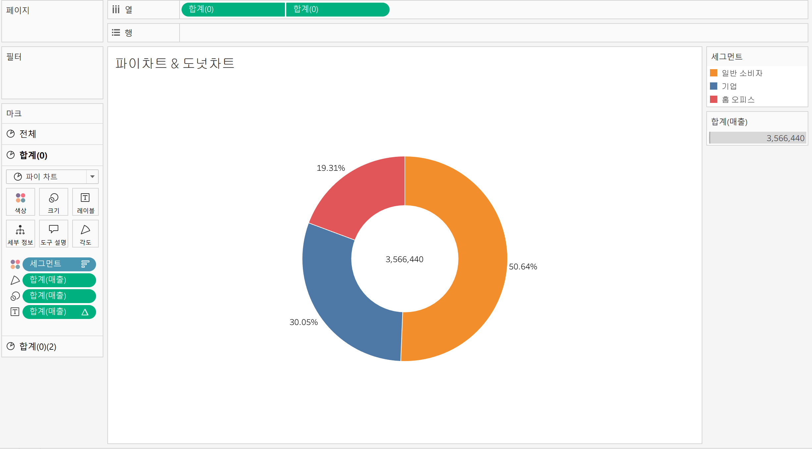
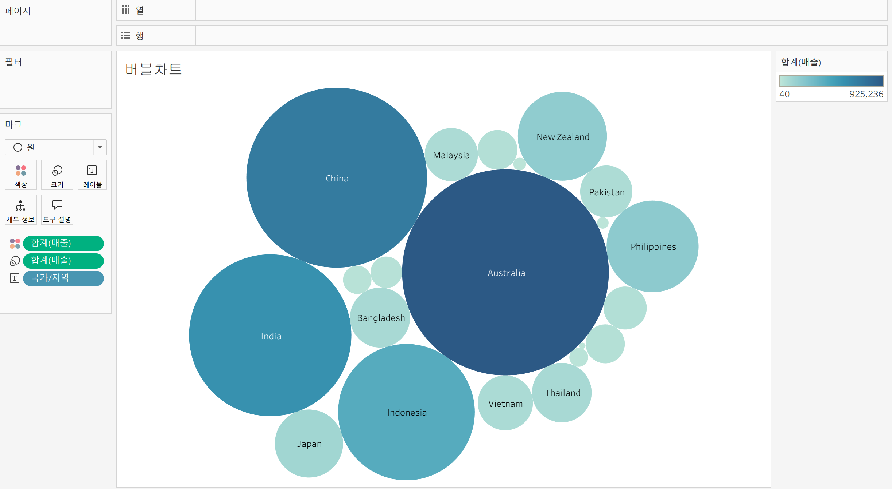
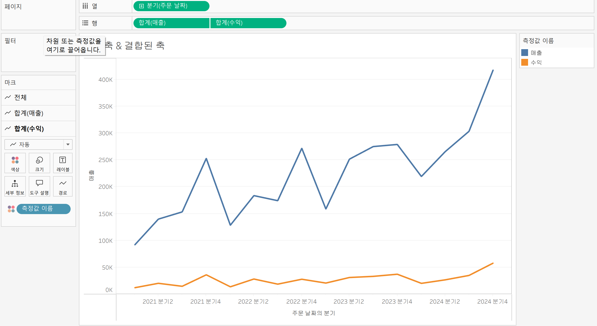
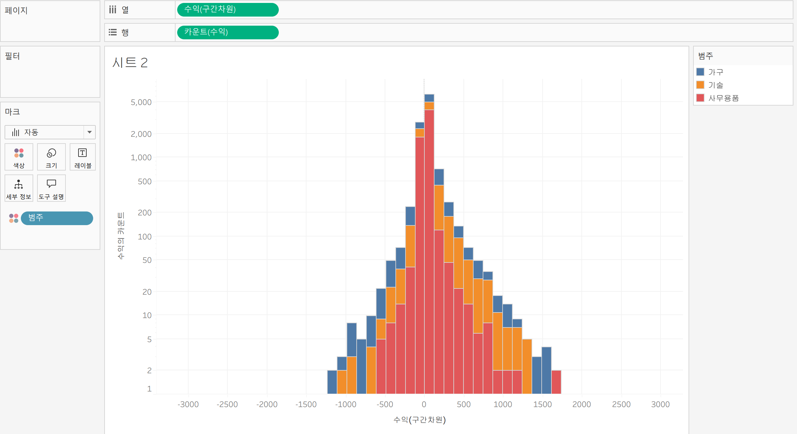
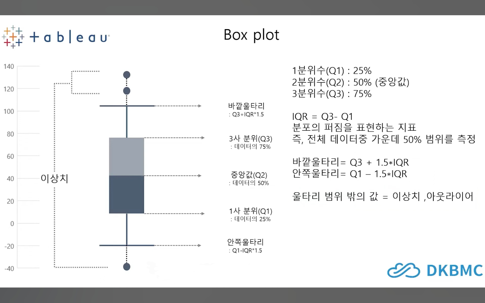
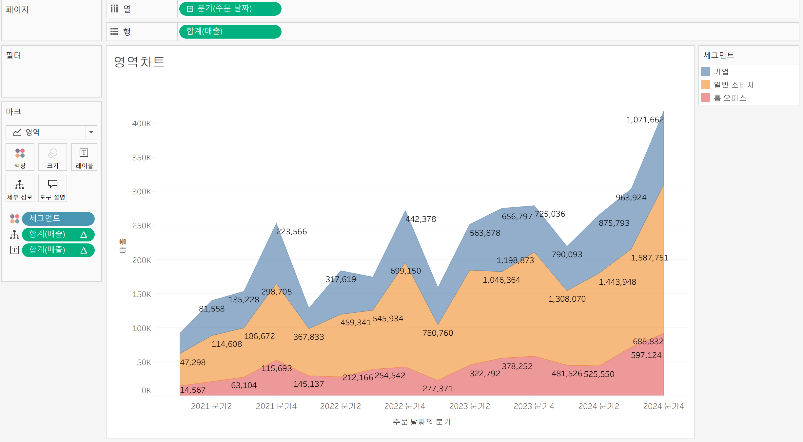
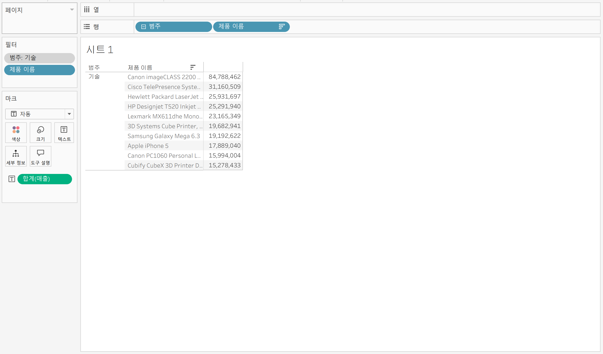

# Tableau 3주차 정규과제

📌Tableau 정규과제는 매주 정해진 **유튜브 강의를 통해 태블로 이론 및 기능을 학습한 후, 실습 문제를 풀어보며 이해도를 높이는 학습 방식**입니다. 

이번주는 아래의 **Tableau_3rd_TIL**에 명시된 유튜브 강의를 먼저 수강해주세요. 학습 중에는 주요 개념을 스스로 정리하고, 이해가 어려운 부분은 강의 자료나 추가 자료를 참고해 보완하세요. 과제 작성이 끝난 이후에는 **Github에 TIL과 실습 인증 결과를 업로드 후, 과제 시트에 제출해주세요.**


**(수행 인증샷은 필수입니다.)** 

> 태블로를 활용하는 과제인 경우, 따로 캡쳐도구를 사용하여 이미지를 첨가해주세요.


## Tableau_3rd_TIL

### 20. 파이와 도넛차트

### 21. 워드와 버블차트

### 22. 이중축과 결합축

### 23. 분산형 차트

### 24. 히스토그램

### 25. 박스 플롯

### 26. 영역차트

### 27. 간트차트

### 28. 필터

### 29. 그룹


<br>

## 주차별 학습 (Study Schedule)

| 주차  | 공부 범위          | 완료 여부 |
| ----- | ------------------ | --------- |
| 1주차 | **강의 1 ~ 9강**   | ✅         |
| 2주차 | **강의 10 ~ 19강** | ✅         |
| 3주차 | **강의 20 ~ 29강** | ✅         |
| 4주차 | **강의 30 ~ 39강** | 🍽️         |
| 5주차 | **강의 40 ~ 49강** | 🍽️         |
| 6주차 | **강의 50 ~ 59강** | 🍽️         |
| 7주차 | **강의 60 ~ 69강** | 🍽️         |

<!-- 여기까진 그대로 둬 주세요-->


---

# 학습 내용 정리

## 20강: 파이와 도넛차트
<!-- 파이와 도넛차트에 관해 배우게 된 점을 적어주세요 -->

> **🧞‍♀️ 도넛차트를 생성하는 법을 기록해주세요.**

태블로에서 도넛 차트를 생성하는 방법은 다음과 같습니다:

1. **파이 차트 생성**
   - 세그먼트와 매출 필드를 더블 클릭하여 시각화에 추가합니다.
   - 우측 상단의 표현 방식을 파이 차트로 변경합니다.
   - 표준 선을 전체 보기로 바꾸고, 매출을 레이블에 추가하여 수치를 표시합니다.
   - 레이블 필드를 마우스 오른쪽 클릭 → 퀵 테이블 계산 → 구성 비율로 변경합니다.

2. **임의의 축 추가**
   - 열 선반의 빈 공간을 더블 클릭하여 필드 생성 창을 엽니다.
   - '0'을 입력해 임의의 축을 만듭니다.
   - 만든 필드를 Ctrl 키를 누른 채 옆으로 드래그하여 두 개의 원(파이 차트)을 만듭니다.

3. **이중축 적용 및 도넛 차트 완성**
   - 두 번째 마크에서 불필요한 값을 제거하고, 레이블에 매출을 넣고 사이즈를 조정합니다.
   - 상단의 두 번째 필드를 우클릭(또는 역삼각형 표시 클릭) → 이중축을 선택합니다.
   - 작은 파이 차트의 색상을 흰색으로 변경해 도넛 모양을 만듭니다.

4. **시각적 요소 정리**
   - 시트에서 마우스 오른쪽 클릭 → 서식 → 격자 무늬 및 기준선을 모두 '없음'으로 변경합니다.
   - 축 머리글 표시도 해제합니다.
   - 색상에서 흰색 테두리를 추가해 깔끔하게 마무리합니다.



## 21강: 워드와 버블차트

<!-- 워드와 버블차트에 관해 배우게 된 점을 적어주세요 -->

### 버블 차트
- **정의**: 수치적 데이터를 원(버블)의 크기로 표현하는 차트입니다.
- **실습 방법**:
  - 데이터 테이블에서 국가/지역과 매출을 선택하여 버블 차트를 생성합니다.
  - 매출을 색상 마크에 넣어 크기뿐 아니라 색상으로도 매출을 시각화할 수 있습니다.
  - 표준 보기에서 전체 보기로 변경해 차트를 최적화합니다.
- **특징**: 국가별 매출을 원의 크기와 색상으로 한눈에 비교할 수 있습니다.



### 워드 클라우드
- **정의**: 문서 내 키워드의 등장 빈도를 텍스트 크기로 표현하는 시각화 차트입니다.
- **실습 방법**:
  - 국가/지역의 등장 횟수를 카운트하여 크기 마크에 넣고, 레이블 마크에도 추가합니다.
  - 마크 유형을 텍스트로 변경해 워드 클라우드 형태로 만듭니다.
  - 매출을 색상 마크에 넣어 등장 빈도와 매출을 동시에 시각화할 수 있습니다.
  - 전체 보기로 변경해 차트를 최적화합니다.
- **특징**: 등장 횟수와 매출을 크기와 색상으로 직관적으로 파악할 수 있습니다.


## 22강: 이중축과 결합축

<!-- 이중축과 결합축에 관해 배우게 된 점을 적어주세요 -->

- **이중축** : 하나의 뷰 안에서 두 개의 축(예: 매출과 수익)을 각각 독립적으로 사용합니다. 각 축에 개별적으로 마크(그래프 유형 등)를 적용할 수 있습니다. 이중축을 만들려면, 두 측정값을 추가한 후, 합치고자 하는 필드에서 마우스 우클릭(또는 역삼각형 표시 클릭) 후 '이중축'을 선택합니다. 이후 축을 동기화하여 하나로 공유할 수 있습니다. 각 축의 마크는 독립적으로 수정 가능합니다.



- **결합축** : 여러 측정값이 하나의 축을 공유하는 방식입니다. 측정값 중 가장 큰 범위의 축을 공유하며, 마크창에 '측정값' 선반이 생성되어 여러 측정값을 추가할 수 있습니다. 결합축을 만들려면, 측정값 필드를 같은 축(예: 왼쪽 축)으로 드래그하여 추가합니다. 

→ 이중축은 각 축을 독립적으로 조정할 수 있고, 결합축은 여러 값을 하나의 축에서 비교할 때 유용합니다.


## 23강: 분산형 차트

<!-- 분산형 차트에 관해 배우게 된 점을 적어주세요 -->

```js
강의 영상과 달리, 우리 파일에는 '제조 업체' 필드가 없습니다. 필요한 경우, 계산된 필드를 이용해 'SPLIT([제품 이름], ' ', 1)'를 '제조 업체'로 정의하시고 세부 정보에 놓아주세요.
```


> 분산형 차트는 파라미터(변수) 간의 상관관계를 파악하는 데 유용한 그래프

- 매출 필드를 열 선반에, 수익 필드를 행 선반에 드래그하여 기본 분산형 차트를 만듭니다.
- 제조업체별로 데이터를 구분하려면 '제조업체'를 세부 정보에, '제품 범주'를 색상 마크에 드래그합니다.
- 분산형 차트에서는 추세선을 많이 활용하며, 범주별 또는 전체 추세선을 추가 가능
- 범주별 추세선과 전체 추세선을 한 번에 보고 싶을 때는 이중축 기능을 사용합니다.
- 범례에서 항목을 클릭하면 하이라이트되어 분석이 용이합니다.

시각화된 분산형 차트를 통해 매출 상승에 따른 일반적인 수익 상승 추이뿐만 아니라, 추세와 상반되는 제조업체도 확인할 수 있습니다. 


## 24강: 히스토그램

<!-- 히스토그램에 관해 배우게 된 점을 적어주세요 -->


> 히스토그램은 연속형 측정값의 분포 형태를 시각화하는 차트입니다. 막대그래프와 비슷해 보이지만, 불연속형이 아닌 연속형 데이터를 구간(범위)별로 그룹화하여 표현한다는 점이 다르다.

- 구간 차원(빈, pocket)은 연속형 데이터를 일정한 크기의 범위로 나누어 각 범위에 속하는 값의 빈도를 나타냅니다.
- 태블로에서는 구간 차원을 직접 생성하거나, 히스토그램 차트 유형을 선택하면 자동으로 구간 차원이 생성됩니다.
- 히스토그램의 막대는 서로 붙어 있으며, 수치 데이터의 빈도를 나타냅니다. 반면, 막대그래프는 불연속형 범주 데이터를 비교하며 막대 사이에 공백이 있습니다.
- 구간 크기, 축 편집(로그 스케일 등), 색상 마크를 활용해 다양한 방식으로 히스토그램을 조정할 수 있습니다.



## 25강: 박스플롯

<!-- 박스플롯에 관해 배우게 된 점을 적어주세요 -->


> 박스플롯은 데이터의 분포와 이상치(outlier)를 한눈에 파악할 수 있는 그래프입니다.

 다섯 개의 구간(최소값, 1사분위(Q1), 중앙값(Q2), 3사분위(Q3), 최대값)을 시각적으로 표현합니다.

- Q1(1사분위)은 데이터의 25% 위치
- Q2(중앙값)은 50% 위치
- Q3(3사분위)은 75% 위치

IQR(Interquartile Range)은 Q3에서 Q1을 뺀 값으로, 데이터 분포의 퍼짐 정도를 나타냅니다.

    바깥 울타리는 Q3 + 1.5*IQR, 안쪽 울타리는 Q1 - 1.5*IQR로 계산하며, 이 범위를 벗어난 값은 이상치로 간주




## 26강: 영역차트

<!-- 영역차트에 관해 배우게 된 점을 적어주세요 -->

> 영역차트는 라인과 축 사이의 공간이 색상으로 채워진 라인 차트입니다.

주로 연속형 데이터의 누계(누적 합계)를 시각적으로 표현하는 데 사용됩니다.
- 태블로에서 영역차트를 만들려면, 예시로 주문 날짜(분기별)를 열 선반에, 매출을 행 선반에 배치합니다.
- 세그먼트(고객 유형 등)를 색상에 넣으면 세그먼트별로 분리된 영역차트를 볼 수 있습니다.
- 레이블을 추가해 수치를 표시할 수 있고, 색상 및 세그먼트 순서도 편집할 수 있습니다.
- 구성 비율(비중)도 테이블 계산을 통해 표시할 수 있습니다.
- 표준 보기를 전체 보기로 바꾸면 완성된 영역차트를 확인할 수 있습니다.



## 27강: 간트차트

<!-- 간트차트에 관해 배우게 된 점을 적어주세요 -->

> 간트 차트는 시간 경과에 따른 기간을 시각화하는 데 주로 사용됩니다.

태블로에서 간트 차트를 만들기 위해서는 배송 날짜와 주문 날짜의 차이를 계산하여 '배송 기간' 필드를 생성

- '배송 기간'은 date dif 함수를 사용해 일(day) 단위로 계산할 수 있습니다.
- 배송 기간 필드는 마크 카드의 '크기'에 드래그하여 시각화하며, 집계 방식은 '합계'가 아닌 '평균'으로 변경해야 올바른 데이터를 볼 수 있습니다.
- 제품 범주, 하위 범주, 고객 이름 등 다양한 필드를 활용해 데이터를 세분화하고, 배송 형태별로 색상을 지정해 가독성을 높일 수 있습니다.
- 필터 기능을 사용해 특정 고객의 데이터만 선택적으로 볼 수 있습니다.


## 28강: 필터

<!-- 필터에 관해 배우게 된 점을 적어주세요 -->


**필터의 중요성**

: 데이터 분석에서 필터는 뷰, 쿼리 속도, 데이터 용량 등 다양한 측면에서 성능에 큰 영향을 미칩니다.

**필터 적용 순서**

: 태블로에서는 추출 데이터 → 원본 → Context → 차원 → 측정값 → 필터 순으로 필터가 적용됩니다. 

**추출 필터**

: 데이터 추출 시 일부 데이터만 저장하여 로컬에서 작업할 수 있습니다. 추출 필터는 데이터를 가져오거나 저장할 때 최우선적으로 적용됩니다. 

**데이터 원본 필터**

: 데이터 원본에서 일부만 워크스페이스로 불러올 때 사용합니다. 

**컨텍스트 필터(Context Filter)**

: 여러 필터가 있을 때, 특정 필터를 컨텍스트로 지정하면 다른 필터가 이에 종속되어 적용됩니다. 이를 통해 원하는 데이터만 정확히 필터링할 수 있습니다. 

**차원 필터**

: 특정 필드의 값을 직접 선택하거나, 제외하거나, 와일드카드, 조건, 상위 n개 등 다양한 방식으로 필터링할 수 있습니다. 



## 29강: 그룹

<!-- 그룹에 관해 배우게 된 점을 적어주세요 -->


### 주요 학습 내용

**그룹의 정의**

: 그룹은 데이터 원본에 없는 사용자 지정 그룹 필드를 만들어, 필드에 있는 항목들을 수동으로 묶을 수 있는 기능입니다.

**그룹 생성 방법**
:
  1. **비주얼(뷰)에서 직접 그룹 만들기**: 차트에서 원하는 항목들을 드래그로 선택한 후, 마우스 우클릭 → '그룹'을 선택하면 새 그룹 필드가 생성됩니다.
  2. **필드에서 그룹 만들기**: 데이터 패널의 필드(예: 제품 이름)에서 마우스 우클릭 → '만들기' → '그룹'을 선택한 후, 그룹 설정 화면에서 항목들을 선택해 그룹화할 수 있습니다.

**그룹 활용**

: 그룹 필드를 차트의 색상 또는 열/행 선반에 배치해 그룹별로 데이터를 시각화할 수 있습니다.

**기타 그룹 처리**

: 그룹화하지 않은 나머지 항목들은 '기타' 그룹으로 묶을 수 있습니다.

**필터링**

: 필요에 따라 '기타' 그룹을 필터링해 차트의 가독성을 높일 수 있습니다.


# 확인문제

## 문제 1.

```js
푸앙이는 superstore 데이터셋에서 '주문' 테이블을 보고 있습니다.
1) 국가/지역 - 시/도- 도시 의 계층을 생성했습니다. 계층 이름은 '위치'로 설정하겠습니다.
2) 날짜의 데이터 타입을 '날짜'로 바꾸었습니다.

코로나 시기의 도시별 매출 top10을 확인하고자
1) 배송 날짜가 코로나시기인 2021년, 2022년에 해당하는 데이터를 필터링했고
2) 위치 계층을 행으로 설정해 펼쳐두었습니다.
이때, 매출의 합계가 TOP 10인 도시들만을 보았습니다.
```


```
겉보기에는 전체 10개로, 잘 나온 결과처럼 보입니다. 그러나 푸앙이는 치명적인 실수를 저질렀습니다.
오늘 배운 '컨텍스트 필터'의 내용을 고려하여 올바른 풀이 및 결과를 구해주세요.
```

<!-- DArt-B superstore가 아닌 개인 superstore 파일을 사용했다면 값이 다르게 표시될 수 있습니다.-->


## 문제 2.

```js
미정이는 관심이 있는 제품사들이 있습니다. '제품 이름' 필드에서 '삼성'으로 시작하는 제품들을 'Samsung group'으로, 'Apple'으로 시작하는 제품들을 'Apple group'으로, 'Canon'으로 시작하는 제품들을 'Canon group'으로, 'HP'로 시작하는 제품들을 'HP group', 'Logitech'으로 시작하는 제품들을 'Logitech group'으로 그룹화해서 보려고 합니다. 나머지는 기타로 설정해주세요. 이 그룹화를 명명하는 필드는 'Product Name Group'으로 설정해주세요.

(이때, 드래그보다는 멤버 찾기 > 시작 문자 설정하여 모두 찾아 한번에 그룹화해 확인해보세요.)
```


```js
해당 그룹별로 어떤 국가/지역이 주문을 많이 차지하는지를 보고자 합니다. 매출액보다는 주문량을 보고 싶으므로, 주문Id의 카운트로 계산하겠습니다.

기타를 제외하고 지정한 5개의 그룹 하위 목들만을 이용해 아래와 같이 지역별 누적 막대그래프를 그려봐주세요.
```


<br>

<br>

### 🎉 수고하셨습니다.