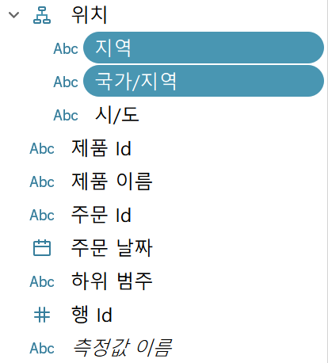
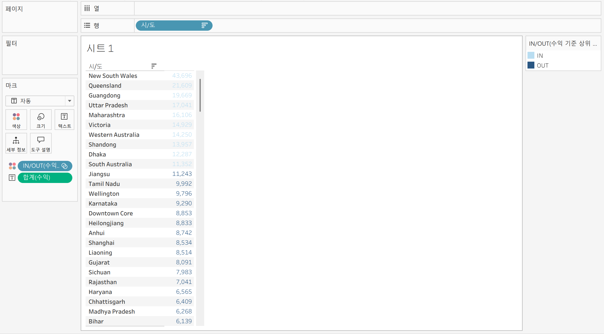

# Tableau 4주차 정규과제

📌Tableau 정규과제는 매주 정해진 **유튜브 강의를 통해 태블로 이론 및 기능을 학습한 후, 실습 문제를 풀어보며 이해도를 높이는 학습 방식**입니다. 

이번주는 아래의 **Tableau_4th_TIL**에 명시된 유튜브 강의를 먼저 수강해주세요. 학습 중에는 주요 개념을 스스로 정리하고, 이해가 어려운 부분은 강의 자료나 추가 자료를 참고해 보완하세요. 과제 작성이 끝난 이후에는 **Github에 TIL과 실습 인증 결과를 업로드 후, 과제 시트에 제출해주세요.**

**(수행 인증샷은 필수입니다.)** 

> 태블로를 활용하는 과제인 경우, 따로 캡쳐도구를 사용하여 이미지를 첨가해주세요.

## Tableau_4th_TIL

### 30. 계층

### 31. 집합

### 32. 결합집합

### 33. 계산된 필드

### 34. 행수준계산

### 35. 집계계산

### 36. 테이블 계산

### 37. 퀵테이블 계산(1)

### 38. 퀵테이블 계산(2)

 

## 주차별 학습 (Study Schedule)

| 주차  | 공부 범위          | 완료 여부 |
| ----- | ------------------ | --------- |
| 1주차 | **강의 1 ~ 9강**   | ✅         |
| 2주차 | **강의 10 ~ 19강** | ✅         |
| 3주차 | **강의 20 ~ 29강** | ✅         |
| 4주차 | **강의 30 ~ 38강** | ✅         |
| 5주차 | **강의 39 ~ 49강** | 🍽️         |
| 6주차 | **강의 50 ~ 59강** | 🍽️         |
| 7주차 | **강의 60 ~ 69강** | 🍽️         |

> **🧞‍♀️ 오늘의 스터디는 지니와 함께합니다.**

<!-- 여기까진 그대로 둬 주세요-->

---

# 학습 내용 정리

## 30. 계층

<!-- 계층 구조와 관련된 개념, 사용 방법 등을 적어주세요. -->

### 계층 구조 개념

> 계층(Hierarchy)은 데이터를 상위에서 하위로 단계적으로 분류할 수 있도록 구조화하는 방법입니다.
- 예를 들어, 날짜(연도 > 분기 > 월 > 일)나 지역(국가 > 시도 > 도시)처럼 큰 범주에서 작은 범주로 세분화할 때 사용합니다.
- 계층을 활용하면 데이터를 드릴다운(drill down)하여 세부적인 정보를 쉽게 탐색할 수 있습니다.

### 사용 방법 (태블로 기준)

1. **자동 생성 계층**
   - 날짜 데이터나 위치 데이터처럼 태블로에서 인식 가능한 필드는 자동으로 계층이 생성됩니다.
   - 예: 배송 날짜 필드를 행 선반에 올리면 연도, 분기, 월, 일로 자동 계층화됨 

2. **수동 계층 생성**
   - 데이터 원본에서 두 개 이상의 필드를 선택 후 마우스 우클릭 → '계층' → '계층 만들기' 선택
   - 계층 이름을 입력하고, 추가로 필요한 필드를 드래그하여 계층에 포함시킴 
   - 계층 내 필드 순서는 드래그 앤 드롭으로 변경 가능

3. **계층 활용**
   - 시각화에서 계층 필드의 좌측 기호(+)를 클릭하면 하위 단계로 드릴다운 가능
   - 예: 지역별 매출에서 시도별, 도시별로 세부 매출 확인 가능

### 요약
- 계층 구조는 데이터를 논리적으로 분류하고, 사용자가 원하는 수준까지 세부적으로 분석할 수 있게 해줍니다.
- 태블로에서는 자동/수동으로 계층을 만들고, 시각화에서 손쉽게 드릴다운하여 데이터 탐색이 가능합니다.

## 31. 집합

<!-- 집합의 정의 및 활용 방법에 대해 알게 된 점을 적어주세요. -->

집합은 사용자가 직접 특정 조건을 설정하고, 그 조건을 충족하는 데이터들을 묶어서 구분하는 방법입니다. 태블로에서 집합을 활용하면 데이터 내에서 원하는 기준에 따라 그룹을 만들고, 이를 시각화에 적용해 데이터 분석을 더욱 효과적으로 할 수 있습니다.

### 집합의 정의
집합(Set)은 사용자가 지정한 조건에 따라 데이터의 하위 집합을 생성하는 기능입니다.
- Ex. 수익이 높은 상위 10개 도시와 나머지 도시를 구분할 수 있습니다. 

### 집합의 활용 방법
1. **집합 만들기**
   - 필드(예: 도시명)에서 우클릭 → '집합 만들기' 선택
   - 일반, 조건, 상위 탭에서 원하는 기준 설정
2. **조건 설정**
   - 일반: 수동으로 항목 선택
   - 조건: 특정 조건(예: 수익 > 1000) 충족 시 포함
   - 상위: 특정 필드 기준 상위/하위 N개 선택 (예: 수익 기준 상위 10개 도시)
3. **시각화에 적용**
   - 생성된 집합 필드를 마크 카드의 색상 등으로 드래그하여 IN/OUT 그룹을 시각적으로 구분
   - 색상, 레이블 등으로 집합에 포함된 데이터와 그렇지 않은 데이터를 명확히 표현
4. **동적 업데이트**
   - 데이터가 변경되어도 집합 조건에 따라 자동으로 그룹이 갱신됨

이처럼 집합을 활용하면 데이터의 특정 부분을 집중적으로 분석하거나, 조건에 따라 데이터를 동적으로 분류할 수 있습니다.

## 32. 결합집합

<!-- 결합집합의 개념 및 사용 사례를 적어주세요. -->

집합 : 하나의 조건 설정 가능

-> 두 가지의 조건을 설정하기 위해서는 결합된 집합 사용해야 함

> 결합된 집합은 태블로에서 두 개 이상의 집합(Set)을 결합하여 여러 조건을 동시에 적용하거나 비교할 수 있도록 해주는 기능입니다.

 EX. "매출이 5만 원 이상인 도시"와 "수익률이 10% 이상인 도시"라는 두 집합을 각각 만든 후, 이 두 집합을 결합하면 다음과 같은 네 가지 옵션으로 데이터를 구분할 수 있습니다:

1. 두 집합 중 하나라도 해당되는 데이터(합집합)
2. 두 집합 모두에 해당되는 데이터(교집합)
3. 첫 번째 집합에는 해당되지만 두 번째 집합에는 해당되지 않는 데이터
4. 두 번째 집합에는 해당되지만 첫 번째 집합에는 해당되지 않는 데이터

이렇게 결합된 집합을 활용하면 여러 조건을 복합적으로 적용하여 데이터를 시각화하거나 분석할 수 있습니다. 

## 33. 계산된 필드

<!-- 계산된 필드를 사용하는 방법과 예시를 적어주세요. -->

## 34. 행수준계산

<!-- 행수준 계산의 의미와 적용 방법을 적어주세요. -->

## 35. 집계계산

<!-- 집계계산의 정의 및 활용 사례에 대해 알게 된 점을 적어주세요. -->

## 36. 테이블계산

<!-- 테이블 계산의 개념 및 사용 방법을 적어주세요. -->

## 37. 퀵테이블계산(1)

<!-- 퀵테이블 계산의 원리 및 예제에 대해 알게 된 점을 적어주세요. -->

## 38. 퀵테이블계산(2)

<!-- 이동평균, YTD 총계, 전년 대비 성장률, YTD 성장률 등 본 강의에서 알게 된 점을 적어주세요. -->

# 확인문제

## 문제 1.

푸앙이는 이제껏 매출을 올리는 데에 힘썼었지만, 왠지 모르게 주머니에 들어오는 돈이 없어 속상합니다. 

그래서 매출이 상위 20곳에 속하지만, 수익률(%)이 마이너스인 시/도를 확인하려고 합니다.

> **수익률은 SUM([수익]) / SUM([매출])로 정의합니다.**

어떤 집합을 만들었고, 어떤 결합을 하였는지를 중심으로 기술하고, 결과 자료를 첨부해주세요. (텍스트 표 형태이며, 색상으로 위 집합을 구분할 수 있게 만들어주세요.)

<!-- 아래 예시 이미지를 삭제하고, 직접 만든 시트 사진을 올려주세요. 시트의 이름은 본인 이름으로 기입해주세요-->

## 문제 2.

> **푸앙이는 주문 Id별로 주문에서 배송까지에 걸리는 날짜 일수가 궁금했습니다. 
> 그래서 주문 ID별로 주문에서 배송까지 걸리는 일자를 '배송까지 걸린 일수'라는 계산된 필드로 만들고, 이를 마크에 올린 후 확인해보았습니다.  이때, 계산된 필드의 식은 'DATEDIFF' 함수를 이용하였습니다.**

**배송까지 걸린 일수 계산을 위한 DATEDIFF 함수 수식을 적어주세요.**

~~~
여기에 답을 적어주세요! 
~~~

>  **그런데 위 그림처럼 '주문 날짜'와 '배송 날짜'를 함께 행에 올려 확인해보니, 주문날짜와 배송날짜의 차이가 '배송까지 걸린 일수'와 다릅니다. ID-2021-11126을 보니, 11월 26일 배송에 11월 30일 배송이면 4일 차이인데, 12일이 걸렸다고 하네요. 왜 이런 문제가 생긴걸까요?**

~~~
여기에 답을 적어주세요!
~~~

> **그리고 이를 해결하기 위해서는 어떻게 해야할까요?**

~~~
여기에 답을 적어주세요!
~~~

## 문제 3.

다음은 Tableau의 다양한 계산을 사용할 수 있는 경우를 빈칸으로 두고 문제를 작성한 것입니다. 각 빈칸에 적합한 계산 유형을 채워보세요.

> 보기 
>
> **누계, 차이, 비율 차이, 구성 비율, 순위, 백분위수, 이동 평균, YTD 총계, 통합 성장률, 전년 대비 성장률, YTD 성장률**

| 계산 유형       | 설명                                     | 사용 예시                                                    |
| --------------- | ---------------------------------------- | ------------------------------------------------------------ |
| 여기에 적으세요 | 데이터의 누적 합계를 계산                | 한 기업이 월별 매출 데이터를 누적하여 연간 매출 추이를 보고 싶을 때 사용 |
| ____________    | 연속 데이터 포인트 간의 차이를 계산      | 한 기업이 월별 매출 데이터에서 전월 대비 매출 증감량을 분석하고 싶은 경우 |
| ____________    | 연속 데이터 포인트 간의 비율 변화를 계산 | 한 기업이 월별 매출 데이터에서 전월 대비 매출 증감률(%)을 분석하고 싶은 경우 |
| ____________    | 전체에서 각 데이터 포인트의 비율을 계산  | 한 기업이 전체 매출에서 각 제품군이 차지하는 비율을 보고 싶을 때 사용 |
| ____________    | 데이터의 순위를 매깁니다                 | 한 기업이 제품별 매출 데이터를 순위별로 정렬하여 상위 10개 제품을 분석하고 싶은 경우 |
| ____________    | 데이터의 백분위를 계산                   | 한 기업이 고객별 구매 금액 데이터를 백분위수로 나누어 상위 25% 고객을 분석하고 싶은 경우 |
| ____________    | 일정 기간의 평균을 계산                  | 한 기업이 주간 매출 데이터에서 4주 이동 평균을 계산하여 트렌드를 분석하고 싶은 경우 |
| ____________    | 연초부터 현재까지의 총계를 계산          | 한 기업이 월별 매출 데이터를 연초부터 현재까지 누적하여 연간 매출 목표 달성 여부를 분석하고 싶은 경우 |
| ____________    | 일정 기간 동안의 연평균 성장률을 계산    | 한 기업이 5년 간 매출 데이터를 바탕으로 연평균 성장률(CAGR)을 계산하고 싶은 경우 |
| ____________    | 전년 동기간 대비 성장률을 계산           | 한 기업이 월별 매출 데이터에서 전년 동월 대비 매출 성장률을 분석하고 싶은 경우 |
| ____________    | 연초부터 현재까지의 성장률을 계산        | 한 기업이 올해 연초부터 현재까지의 매출이 전년 동기 대비 얼마나 성장했는지 분석하고 싶은 경우 |

> 사용 예시를 참고하여 실제 경우처럼 생각하며 고민해보아요!

 

 

### 🎉 수고하셨습니다.