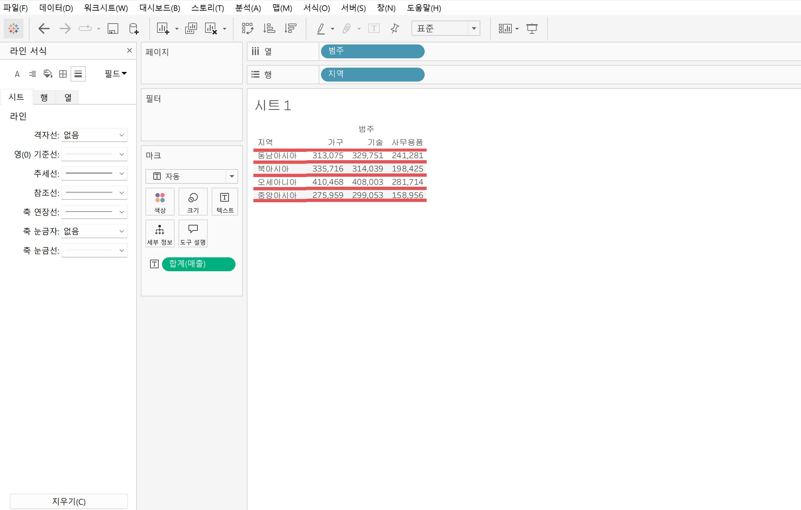
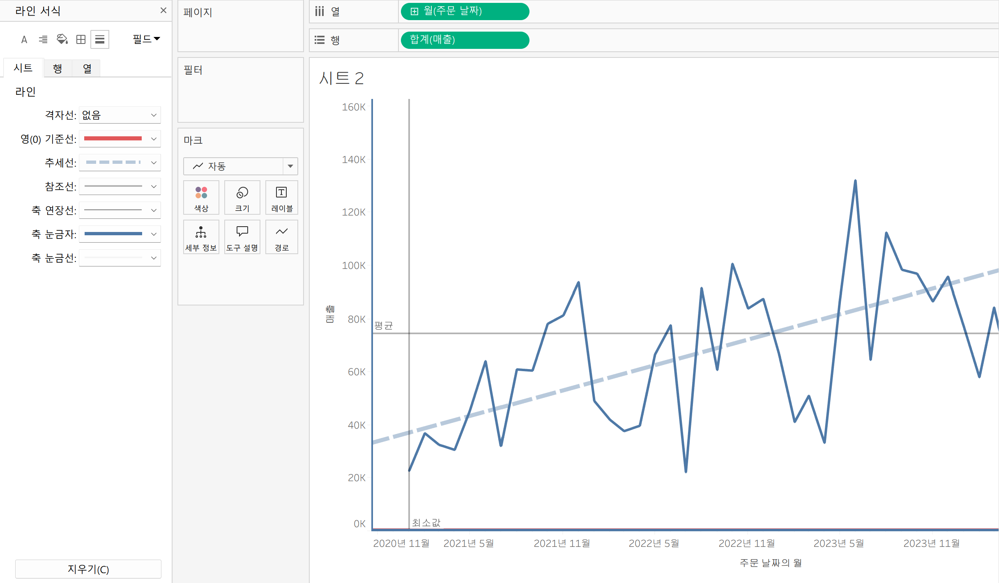

# Tableau 6주차 정규과제

📌Tableau 정규과제는 매주 정해진 **유튜브 강의를 통해 태블로 이론 및 기능을 학습한 후, 실습 문제를 풀어보며 이해도를 높이는 학습 방식**입니다. 

이번주는 아래의 **Tableau_6th_TIL**에 명시된 유튜브 강의를 먼저 수강해주세요. 학습 중에는 주요 개념을 스스로 정리하고, 이해가 어려운 부분은 강의 자료나 추가 자료를 참고해 보완하세요. 과제 작성이 끝난 이후에는 **Github에 TIL과 실습 인증 결과를 업로드 후, 과제 시트에 제출해주세요.**


**👀(수행 인증샷은 필수입니다.)** 

> 태블로를 활용하는 과제인 경우, 따로 캡쳐도구를 사용하여 이미지를 첨가해주세요.


## Tableau_6th_TIL

### 48. 워크시트 서식(2)

### 49. 대시보드 패널

### 50. 대시보드 구성방식

### 51. 대시보드 컨테이너

### 52. 레이아웃 패널

### 53. 필터 동작

### 54. 대시보드 하이라이터 동작

### 55. 대시보드 URL

### 56. 대시보드 시트에 이동 동작

### 57. 매개변수 변경 동작


<br>

## 주차별 학습 (Study Schedule)

| 주차  | 공부 범위          | 완료 여부 |
| ----- | ------------------ | --------- |
| 1주차 | **강의 1 ~ 9강**   | ✅         |
| 2주차 | **강의 10 ~ 19강** | ✅         |
| 3주차 | **강의 20 ~ 29강** | ✅         |
| 4주차 | **강의 30 ~ 38강** | ✅         |
| 5주차 | **강의 39 ~ 47강** | ✅         |
| 6주차 | **강의 48 ~ 57강** | ✅         |
| 7주차 | **강의 58 ~ 67강** | 🍽️         |

> **🧞‍♀️ 오늘은 강의보다 실습과 대시보드 직접 만들기가 더 중요하니, 기록보다는 사고하며 강의를 들어주세요.**

<!-- 여기까진 그대로 둬 주세요-->


---

# 학습 내용 정리

## 48. 워크시트 서식(2)

워크시트 서식의 마지막 두 가지 옵션인 테두리(Border)와 라인(Line)에 대해 학습

### 🔲 테두리(Border) 서식

테두리 서식은 뷰에 표시된 차트에서 **테이블 셀 및 머리글을 둘러싸는 라인**의 서식을 설정한다.

| 설정 항목 | 설명 |
|---|---|
| 테두리 유형 | 실선, 점선 등 선의 종류 설정 |
| 테두리 두께 | 선의 굵기 조절 |
| 테두리 색상 | 선의 색상 설정 |

- **행/열 구분선 수준(눈금)** 조절로 테두리 기준 필드를 변경할 수 있음
  - 눈금 **왼쪽** → 전체 테이블 기준으로 구분선 표시
  - 눈금 **중간** → 상위 필드(ex. 지역) 기준으로 구분선 표시
  - 눈금 **오른쪽** → 하위 필드(ex. 국가) 기준으로 구분선 표시
- 행 선반에 필드를 추가할수록 구분 가능한 **수준(눈금)이 늘어남**

---

### 📈 라인(Line) 서식

라인 서식은 뷰에서 표시된 **데이터의 축(Axis)에 대한 라인**의 모양을 설정한다.

| 설정 항목 | 설명 |
|---|---|
| 라인 유형 | 선의 종류 설정 |
| 라인 두께 | 선의 굵기 조절 |
| 라인 색상 | 선의 색상 설정 |
| 연 기준선 | 연도 기준 구분선 병용 가능 |
| 추세선 / 참조선 | 각 라인의 서식을 **별도로** 설정 가능 |

---

### ⚡ 테두리 vs 라인 핵심 차이

| 구분 | 테두리(Border) | 라인(Line) |
|---|---|---|
| 적용 대상 | 테이블 셀, 머리글 | 데이터 축(Axis) |
| 주요 역할 | 셀 구분 및 표 형태 강조 | 축 기준선, 추세선, 참조선 서식 |





## 49강. 대시보드패널

여러 개의 차트를 한 화면에 표시할 수 있는 대시보드(Dashboard)의 기본 구성과 패널 사용법을 학습

### 🖥️ 대시보드 기본 구성

새 대시보드 생성 시 화면이 두 영역으로 나뉜다.

| 영역 | 설명 |
|---|---|
| 대시보드 패널 (왼쪽) | 크기, 시트, 개체 등 설정 항목 모음 |
| 대시보드 디자인 페이지 (오른쪽) | 시트와 개체를 실제로 배치하는 공간 |

---

### 📐 크기(Size) 항목

대시보드의 전체 크기를 설정하는 옵션으로, 드롭다운 메뉴로 구성된다.

| 옵션 | 설명 |
|---|---|
| 고정 크기 | 자주 사용하는 해상도 프리셋 제공 (ex. 파워포인트 크기) |
| 자동 | 화면을 채우는 방식으로 자동 조절 |
| 크기 범위 | 최소~최대 범위를 직접 지정 |

---

### 📊 시트(Sheet) 항목

- 현재 통합 문서에 있는 **모든 워크시트**가 자동으로 목록에 표시됨
- 새 워크시트 생성 시 **자동으로 시트 항목에 추가**됨
- 원하는 시트를 **드래그 앤 드롭**으로 대시보드에 배치
- 두 번째 시트 배치 시 **하이라이트**로 배치 공간 구분을 표시해줌

---

### 🧩 개체(Object) 항목

워크시트 외에 추가할 수 있는 다양한 요소들이며, 드래그 앤 드롭으로 배치한다.

| 개체 | 활용 예시 |
|---|---|
| 텍스트 상자 | 대시보드 제목 입력 |
| 이미지 | 파일 삽입 또는 링크로 이미지 표시 |
| 웹 페이지 | 외부 웹사이트 URL 연결해 정보 표시 |

---

### 📱 기기 미리보기 (Device Preview)

- 다양한 디바이스(데스크탑, 태블릿, 모바일)별 해상도를 지원
- **기기 미리보기 → 기기 유형 및 모델 선택 → 크기 조정 및 재배치** 순서로 적용


## 50. 대시보드 구성방식

> **🧞‍♀️ 부동과 바둑판식 방식을 차이를 중점으로 기술해보세요**

대시보드에 개체를 추가하는 두 가지 구성 방식인 **바둑판식**과 **부동**에 대해 학습

### 📋 두 가지 구성 방식 비교

| 구분 | 바둑판식 (Tiled) | 부동 (Floating) |
|---|---|---|
| 배치 방식 | 격자무늬 구조에 따라 배치 | 원하는 위치에 자유롭게 배치 |
| 다른 개체 영향 | 개체 추가/이동 시 다른 개체 크기 변경됨 | 다른 개체의 크기·모양에 영향 없음 |
| 대시보드 크기 변경 시 | 개체가 유사한 형식 유지 | 개체 위치·형식이 달라질 수 있음 |
| 추천 상황 | 대시보드 크기가 **자주 변경**되는 경우 | 대시보드 크기가 **고정**된 경우 |

---

### 💡 구성 방식별 사용 팁

**바둑판식**
- 개체 배치 시 격자의 특정 위치에만 추가 가능
- 크기가 유동적인 대시보드에 적합

**부동**
- `Shift` + 드래그 앤 드롭으로 부동 개체 추가 가능
- 대시보드 크기가 고정되어 있고 **그래프 내 빈 공간이 많은 경우** 활용하면 효과적
- 빈 공간에 텍스트, 이미지, 워크시트 등을 자유롭게 삽입 가능

---

### ⚡ 요약

> 대시보드 크기가 자주 바뀐다면 → **바둑판식**

> 레이아웃이 고정되고 빈 공간을 채워야 한다면 → **부동**


## 51. 대시보드 컨테이너

대시보드 개체들과 워크시트들을 **그룹화하고 구성**할 수 있는 공간인 **컨테이너**에 대해 학습

### 📦 컨테이너 종류

| 종류 | 설명 | 배열 방향 |
|---|---|---|
| 가로 컨테이너 | 내부 개체들을 수평으로 배열 | ↔ 좌우 |
| 세로 컨테이너 | 내부 개체들을 수직으로 배열 | ↕ 위아래 |

---

### 🏗️ 컨테이너 배치 원칙

- 개체를 배치하기 **전에** 컨테이너를 먼저 배치하는 것이 기본 순서
- **빈 페이지 개체(공백)**를 함께 배치하면 나중에 크기 조정 시 유리
- 컨테이너 안에 컨테이너를 **중첩** 배치 가능 (ex. 세로 컨테이너 안에 가로 컨테이너)
- 배치 후 **레이아웃 탭 → 항목 계층**에서 컨테이너 중첩 구조 확인 가능

---

### 🖥️ 샘플 수익성 대시보드 구성 실습

대시보드가 **행(Row) 구조**로 구성되므로 최상위에 세로 컨테이너를 배치한 뒤, 각 행마다 가로 컨테이너를 중첩하는 방식으로 구성한다.

| 행 | 구성 요소 | 사용 컨테이너 |
|---|---|---|
| 1행 (제목) | 이미지 + 텍스트 상자 + 필터 | 가로 컨테이너 |
| 2행 (배너) | 값 배너 워크시트들 | 가로 컨테이너 |
| 3행 (차트) | 맵 차트(좌) + 라인·막대그래프(우) | 가로 컨테이너 + 세로 컨테이너 중첩 |

---

### 📐 컨테이너 크기 조정

- 개체 클릭 → **개체 잡는 부분 더블 클릭** → 상위 컨테이너 선택
- **기타 옵션 → 높이/너비 편집**에서 픽셀 값 직접 입력
- ⚠️ 높이 편집 옵션이 보이지 않는다면 → 세로 컨테이너가 없거나 가로 컨테이너가 세로 컨테이너 **밖**에 배치된 것이므로 재배치 필요

## 52. 레이아웃 패널

대시보드 디자인을 세밀하게 조정할 수 있는 **레이아웃 탭**의 주요 옵션들을 학습

### 🗂️ 레이아웃 탭 주요 옵션 구성

| 옵션 | 설명 |
|---|---|
| 제목 표시 | 개체의 제목 표시 여부 설정 (기본값: 워크시트 제목) |
| 부동(Floating) | 선택한 개체를 부동 개체로 전환 |
| 위치 | 부동 개체의 X·Y 좌표를 pixel 단위로 조정 |
| 크기 | 부동 개체의 너비·높이를 pixel 단위로 조정 |
| 테두리 | 개체 테두리의 선 유형·두께·색상 설정 |
| 배경(Background) | 선택한 컨테이너의 배경 색상 변경 |
| 바깥쪽 여백 | 컨테이너 모서리와 테두리 사이의 외부 공간 조정 |
| 안쪽 여백 | 개체 모서리와 테두리 사이의 내부 공간 조정 |
| 항목 계층 | 대시보드 내 컨테이너·개체 중첩 구조 확인 |

---

### ⚠️ 부동 옵션 주의사항

- 부동 옵션 **선택 해제** 시 개체가 이전 위치로 **돌아가지 않음**
- 위치·크기 옵션은 **부동 개체에서만** pixel 단위 수정 가능
- 위치 X·Y 값을 `0`으로 설정하면 대시보드 **왼쪽 상단**으로 이동

---

### 🎨 배경 & 여백 활용 팁

- **빈 페이지 개체**에 배경색을 지정하면 구분선처럼 활용 가능
  - ex. 높이 10 + 파란색 → 제목과 데이터 영역 사이 구분선 역할
- 여백 옵션은 기본적으로 **모든 방향 동일**하게 적용
  - 방향별 개별 조정이 필요하면 **"모든 변이 동일" 선택 해제**
- 그래프 컨테이너 바깥쪽 여백을 넓히면 **정렬감과 가독성** 향상

---

### 🔍 항목 계층

- 레이아웃 탭 하단에서 대시보드 전체의 **컨테이너·개체 중첩 구조** 확인 가능
- 항목 계층에서 개체 클릭 시 대시보드에서 해당 개체가 **자동 선택**됨

## 53. 필터 동작

대시보드에서 차트 간 상호작용을 가능하게 하는 **필터 동작(Filter Action)**에 대해 학습

### 🔽 방법 1. 필터 직접 추가

- 차트 클릭 → 드롭다운 메뉴 → **필터 옵션 선택** → 표시할 필터 선택
- 선택한 필터가 컨테이너에 자동 추가됨
- 표시 방법 변경 가능 (ex. 드롭다운 메뉴 형식)
- ✅ 선택 옵션이 **적을 때** 유용
- ❌ 선택 옵션이 **많을 때**는 대시보드 동작 방식이 더 직관적

---

### ⚙️ 방법 2. 대시보드 동작(Dashboard Action)으로 필터 추가

워크시트 간 연계가 없는 기본 상태에서는 차트를 클릭해도 다른 워크시트에 영향을 주지 않는다.
→ **대시보드 동작**을 추가해야 워크시트 간 연동이 가능해진다.

**설정 경로:** 대시보드 탭 → 동작 → 동작 추가 → 필터 선택

| 설정 항목 | 설명 |
|---|---|
| 동작 이름 | 동작을 구분하는 이름 설정 |
| 원본 시트 | 동작을 **발생**시킬 워크시트 선택 |
| 동작 실행 조건 | 마우스 오버 / 선택 / 메뉴 중 선택 |
| 대상 시트 | 동작 실행 시 **변경될** 워크시트 선택 |
| 선택 해제 시 결과 | 선택 해제 후 표시할 데이터 범위 설정 |

---

### 🖱️ 동작 실행 조건 상세

| 조건 | 동작 방식 |
|---|---|
| 마우스 오버 | 마크 위에 마우스를 올리면 나머지 데이터가 해당 마크 기준으로 변경 |
| 선택 | 마크를 **클릭**하면 나머지 데이터가 선택한 마크 기준으로 변경 |
| 메뉴 | 마크 클릭 시 도구 설명에 텍스트가 나타나고, 옵션 선택 시 데이터 변경 |

---

### ⚡ 더 빠른 방법

> 대시보드에서 차트 선택 → **"필터로 사용" 기호 클릭**
> → 동작 리스트에 자동 추가되며, 수동으로 만든 필터 동작과 동일한 기능으로 작동


## 54. 대시보드 하이라이터 동작

필터 동작과 달리 데이터를 숨기지 않고 **선택한 조건에 해당하는 데이터만 강조**하는 **하이라이트 동작(Highlight Action)**에 대해 학습

### 🔦 필터 동작 vs 하이라이트 동작

| 구분 | 필터 동작 | 하이라이트 동작 |
|---|---|---|
| 동작 방식 | 선택한 조건의 데이터만 **표시** | 선택한 조건의 데이터를 **강조**, 나머지는 흐리게 |
| 전체 데이터 | 선택 조건 외 데이터 **숨김** | 전체 데이터 **유지** |
| 활용 목적 | 특정 데이터만 집중해서 보기 | 전체 대비 특정 데이터 **비교** |

---

### ⚙️ 하이라이트 동작 설정

**설정 경로:** 대시보드 탭 → 동작 → 동작 추가 → 하이라이트 선택

| 설정 항목 | 설명 |
|---|---|
| 원본 시트 | 하이라이트를 **발생**시킬 워크시트 선택 |
| 동작 실행 조건 | 마우스 오버 / 선택 / 메뉴 중 선택 |
| 대상 시트 | 하이라이트가 **적용될** 워크시트 선택 |

---

### ⚠️ 하이라이트 동작 작동 조건

> 선택 기준으로 사용하는 **필드**가 대상 차트에 **반드시 포함**되어 있어야 동작함

- 대상 차트에서 해당 필드를 완전히 제거하면 하이라이트가 작동하지 않음
- 필드를 직접 사용하지 않더라도 **마크의 도구 설명에 해당 필드를 포함**시키면 동작 가능


## 55. 대시보드 URL

대시보드와 상호작용 시 사용자를 **특정 웹사이트로 이동**시키는 **URL 이동 동작(URL Action)**에 대해 학습

### 🌐 URL 이동 동작이란?

- 사용자가 대시보드의 차트와 상호작용할 때 **지정한 URL로 연결**하는 기능
- ex. 맵 차트에서 국가 선택 → 해당 국가의 위키피디아 페이지로 이동
- ex. 막대 차트에서 제품 범주 선택 → 해당 제품의 쇼핑 페이지로 이동

---

### ⚙️ URL 이동 동작 설정

**설정 경로:** 대시보드 탭 → 동작 → 동작 추가 → URL로 이동 선택

| 설정 항목 | 설명 |
|---|---|
| 동작 이름 | 도구 설명에 표시되는 **클릭 가능한 텍스트**가 됨 |
| 원본 시트 | 동작을 발생시킬 워크시트 선택 |
| 동작 실행 조건 | 마우스 오버 / 선택 / 메뉴 중 선택 |
| URL | 이동할 웹페이지 주소 입력 |

---

### ⚠️ URL 입력 시 주의사항

- URL에 특정 값을 **고정 텍스트**로 입력하면 어떤 마크를 선택해도 **동일한 페이지**로만 이동
- 선택한 마크에 따라 다른 페이지로 이동하려면 **삽입 기능으로 필드 값을 URL에 포함**시켜야 함
  - ex. `https://en.wikipedia.org/wiki/` + `[국가/지역]` 필드 삽입

---

### 🖥️ 대시보드 내 웹페이지 개체 연동

URL을 별도 브라우저가 아닌 **대시보드 내부에서 바로 표시**하고 싶을 때 활용한다.

1. 대시보드에 **웹페이지 개체** 배치 (URL 입력 없이 확인 클릭 → 빈 공간 생성)
2. URL 이동 동작의 **URL 대상 옵션** 설정
   - 1번 또는 3번 옵션 선택 시 웹페이지 개체 안에서 URL 열림
   - 3번 옵션은 **웹페이지 개체가 있을 때만** 사용 가능
3. 마크 선택 시 해당 페이지가 **대시보드 내 웹페이지 개체에 자동 표시**


## 56. 대시보드 시트에 이동 동작

하나의 대시보드로 모든 데이터를 표시하기 어려울 때, 차트와의 상호작용으로 **다른 대시보드로 이동**할 수 있는 **시트로 이동 동작**에 대해 학습

### 📌 시트로 이동 동작이 필요한 이유

- 대시보드 하나에 모든 차트를 넣으면 **각 차트 크기가 작아져** 데이터 관찰이 어려워짐
- 연관된 세부 데이터를 **별도 대시보드**로 분리하고, 클릭으로 이동하는 방식이 더 효과적

---

### ⚙️ 시트로 이동 동작 설정

**설정 경로:** 대시보드 탭 → 동작 → 동작 추가 → 시트로 이동 선택

| 설정 항목 | 설명 |
|---|---|
| 동작 이름 | 도구 설명에 표시될 **클릭 가능한 링크 텍스트** |
| 원본 시트 | 동작을 발생시킬 워크시트 선택 |
| 동작 실행 조건 | 마우스 오버 / 선택 / 메뉴 중 선택 |
| 대상 시트 | 이동할 **대시보드 또는 워크시트** 선택 |

---

### ⚠️ 이동 후 데이터 연동 주의사항

- 시트로 이동 동작만 설정하면 이동한 대시보드에 **전체 데이터**가 표시됨
- 선택한 값 기준으로 **필터링된 데이터**를 표시하려면 **필터 동작을 별도로 추가**해야 함
  - 원본 시트: 맵 차트 + 실행 조건: 선택
  - 대상 시트: 이동할 대시보드 + 선택 해제 시: 모든 값 표시

---

### 🔙 탐색 단추(Navigation Button)로 돌아가기 기능 구현

이동한 대시보드에서 원래 대시보드로 **돌아가는 단추**를 만들 수 있다.

1. 대시보드 상단에 **탐색 개체** 배치
2. **편집 단추** 클릭 → 이동할 위치(원래 대시보드) 선택
3. 단추 이름 및 색상 설정
4. `ALT` + 클릭으로 단추 작동 확인

> 대시보드가 외부 플랫폼에 임베딩된 경우에도 탐색 단추를 활용하면 사용자 편의성을 높일 수 있다.


## 57. 매개변수 변경 동작

차트의 마크를 클릭하는 것만으로 **매개변수 값을 동적으로 변경**하여 대시보드에 표시되는 데이터 범위를 조절하는 **매개변수 변경 동작(Change Parameter Action)**에 대해 학습

### 📌 매개변수 변경 동작이 필요한 이유

- 특정 날짜 범위의 데이터만 보고 싶을 때 필터를 직접 조작하는 대신
- 차트의 마크를 클릭하는 것만으로 **시작 날짜 · 끝 날짜를 동적으로 설정** 가능

---

### 🔗 매개변수 + 계산된 필드 + 필터 연동 구조

매개변수 변경 동작이 작동하려면 아래 세 가지 요소가 연결되어야 한다.

| 구성 요소 | 역할 |
|---|---|
| 매개변수 (시작 날짜 / 끝 날짜) | 사용자가 선택한 마크의 날짜 값을 저장 |
| 계산된 필드 (주문 날짜 필터) | 주문 날짜가 시작~끝 매개변수 범위 내인지 판별 |
| 필터 카드 | 계산된 필드를 **참(True)**으로 설정해 조건에 맞는 데이터만 표시 |

> 계산식 의미: 주문 날짜 ≥ 시작 날짜 매개변수 **AND** 주문 날짜 ≤ 끝 날짜 매개변수

---

### ⚙️ 매개변수 변경 동작 설정

**설정 경로:** 대시보드 탭 → 동작 → 동작 추가 → 매개변수 변경 선택

| 설정 항목 | 시작 날짜 동작 | 끝 날짜 동작 |
|---|---|---|
| 동작 이름 | 시작 날짜 설정하기 | 마지막 날짜로 설정하기 |
| 원본 시트 | 라인 차트 | 라인 차트 |
| 동작 실행 조건 | 메뉴 | 메뉴 |
| 대상 매개변수 | 주문 날짜 시작 매개변수 | 주문 날짜 끝 매개변수 |
| 원본 필드 | 주문 날짜 월 필드 | 주문 날짜 월 필드 |
| 선택 해제 시 결과 | 2019.01.01 (가장 이른 날짜) | 2022.12.31 (가장 최신 날짜) |

---

### 💡 동작 흐름 요약

```
마크 클릭(메뉴 선택)
→ 매개변수 값 변경 (시작/끝 날짜)
→ 계산된 필드 조건 재평가
→ 필터 카드가 True인 날짜 범위만 표시
→ 대시보드 전체 데이터 업데이트

선택 해제 시 → 매개변수가 초기값으로 복원 → 전체 데이터 다시 표시
```


# 확인 문제

오늘은 별도의 문제가 없습니다. 


여러 대시보드를 참고하시어, superstore 데이터를 사용해 나만의 대시보드를 제작해주세요.

**단, 워크시트 3개 이상의 그래프를 표시해야 하며 각 시트 간 상호작용성 필터 or 하이라이트 동작은 꼭 추가되어야 합니다**

어떤 부분에 가중을 두었는지, 어떤 사용자 편의성을 고려하였는지에 대한 설명이 필요합니다.


<br>

<br>

### 🎉 수고하셨습니다.